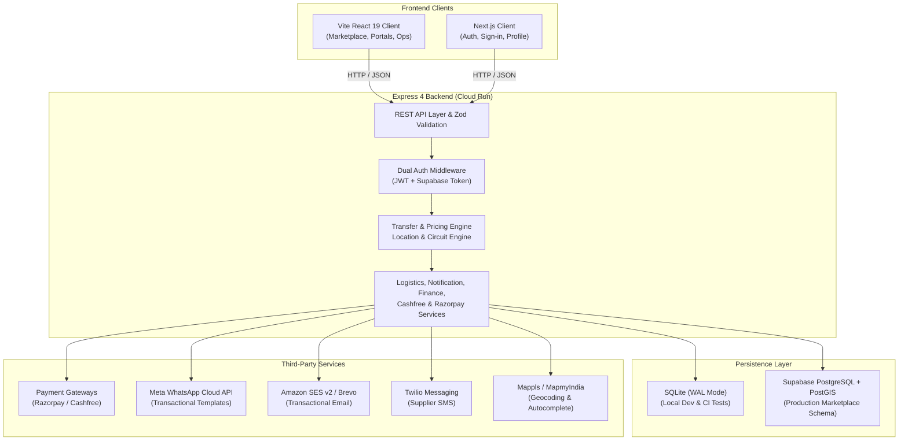
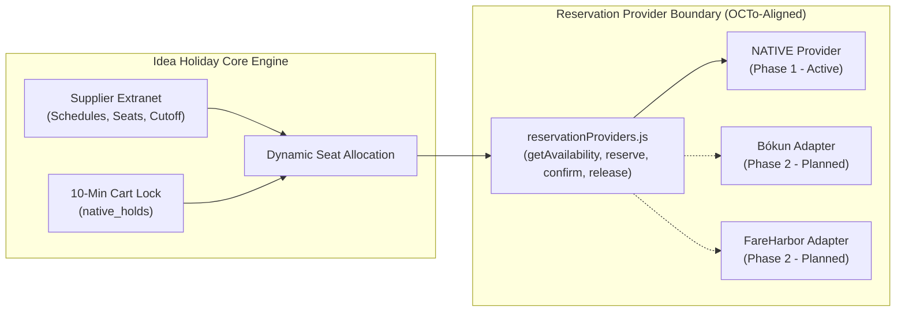
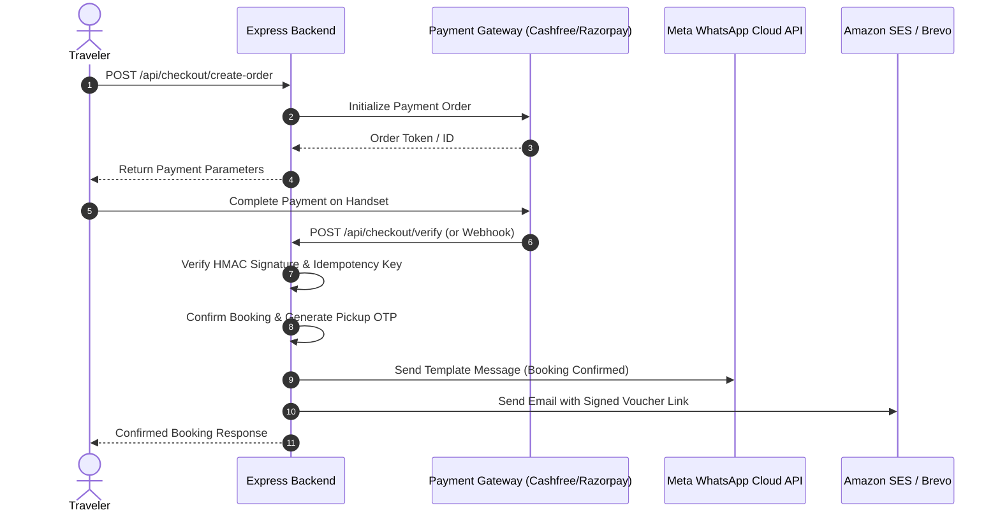

# Technical Architecture: Idea Holiday

## High-Level Architecture Overview

Idea Holiday is constructed as a modern, decoupled web application featuring a dual-client setup, an Express REST API backend, a dual-engine persistence layer, and integrated third-party communication and payment providers.

---

## 1. Client Architecture

### 1.1 Vite React 19 Client (`/frontend`)
- **Technology**: React 19, Vite, Tailwind CSS, Lucide React, QRcode.
- **Role**: Primary marketplace client serving travelers, tour operators, fleet suppliers, ground ops staff, and platform administrators.
- **Routing**: Client-side single page application with lazy-loaded workspaces to meet performance budgets (`< 225 KiB` initial JS entry).
- **Core Views**:
  - Traveler: `/`, `/search`, `/activity/:id`, `/circuit-planner`, `/checkout`, `/circuit-checkout/:id`, `/my-trips`, `/my-reviews`.
  - Supplier: `/supplier/dashboard`, `/supplier/listings`, `/supplier/builder`, `/supplier/transfer-builder`, `/supplier/bookings`, `/supplier/coverage`.
  - Operations: `/ops/live-trip-board`, `/ops/circuits`, `/ops/notifications`, `/ops/support`.
  - Admin: `/admin/overview`, `/admin/suppliers`, `/admin/products`, `/admin/coverage`, `/admin/finance`, `/admin/quality`, `/admin/analytics`.

### 1.2 Next.js Client (`/app`)
- **Technology**: Next.js (App Router), React, Supabase Auth Helpers.
- **Role**: Dedicated authentication and sign-in experiences (Email/Password, Google OAuth), session callbacks, and guest document link landing.

---

## 2. Backend Architecture (`/backend`)

### 2.1 Server Core
- **Technology**: Node.js (ESM), Express 4.19.
- **Request Lifecycle**:
  1. `requestBoundary`: Rejects payloads exceeding 100 KiB, deep nesting (>10 levels), or prototype-pollution keys (`__proto__`, `prototype`, `constructor`).
  2. `helmet`: Enforces strict HTTP security headers and RFC 9116 security policies.
  3. `cors`: Dynamic allowlist restricted to authorized origins.
  4. `express-rate-limit`: Rate limits public endpoints with 429 structured JSON responses.
  5. `authenticate` / `optionalAuthMiddleware`: Verifies bearer credentials.
  6. `validateBody` / `validateQuery` / `validateParams`: Enforces Zod schemas with sanitization.
  7. Route Handlers & Domain Services.
  8. Global Error Handler & Audit Logger.

---

## 3. Persistence Layer

### 3.1 Dual-Engine Strategy
The repository features an abstracted database interface allowing seamless switching between engines via the `DATABASE_ENGINE` environment variable:

| Feature | Local Development & CI | Production Deployment |
| :--- | :--- | :--- |
| **Engine** | **SQLite** (`better-sqlite3`) | **Supabase PostgreSQL** (`pg`) |
| **Driver** | Synchronous embedded database | Pooled PostgreSQL client |
| **Location** | `backend/wanderindia.db` | Supabase Cloud Database |
| **Spatial Engine** | In-memory ray-casting Point-in-Polygon | PostGIS (`ST_Contains`, `ST_GeomFromGeoJSON`) |
| **Migrations** | Custom dual-engine SQL runner (`scripts/migrate.js`) | Versioned SQL scripts in `backend/migrations/` |
| **Journaling** | WAL (Write-Ahead Logging) | Standard WAL / ACID guarantees |

---

## 4. Authentication & Authorization Architecture

The platform supports a dual-token authentication scheme:
1. **Idea Holiday JWT**: Issued directly by `/api/auth/login` and `/api/auth/signup`, signed using `JWT_SECRET` (HS256), containing `{ id, email, role, supplier_id }`.
2. **Supabase Access Token**: Bearer JWT issued by Supabase Auth (e.g. Google Sign-in). The backend verifies it via `supabase.auth.getUser(token)`, then queries its own database to resolve the user's role, permissions, and supplier linkage.

### Ecosystem Roles & Scope Matrix
- `TRAVELER`: Access to own bookings, reviews, support cases, wishlist, wallet, and circuit plans.
- `SUPPLIER`: Access strictly scoped to own supplier profile, driver roster, listings, assignments, and payouts (`WHERE supplier_id = ?`).
- `STAFF` (Operations): Access to all driver dispatches, staff tasks, live trip boards, SLA timeout processors, circuit review queues, and notification logs.
- `ADMIN`: Full platform access including KYB approvals, commission overrides, finance settlements, review moderation, and analytics.

---

## 5. Reservation Engine & OCTo Standards Architecture

Idea Holiday follows the **OCTo (Open Connectivity for Tourism)** specification to provide real-time availability and bookings for direct suppliers in Phase 1, while maintaining a scalable foundation for Phase 2 channel manager adapters (Bókun, FareHarbor).

### OCTo Concept & Field Alignment
| Internal Concept | OCTo Standard Field | Description |
| :--- | :--- | :--- |
| **Product & Option** | `productId`, `optionId` | Standardized catalog hierarchy. |
| **Departure Identity** | `availabilityId`, `availability_slot` | Unique departure slot timestamp (`YYYY-MM-DDTHH:MM:SS`). |
| **Live Availability** | `localDateTimeStart`, `utcCutoffAt`, `capacity`, `vacancies` | Dynamic vacancy calculation. |
| **Reservation Status** | `ON_HOLD`, `CONFIRMED`, `EXPIRED`, `CANCELLED` | Standard booking lifecycle. |
| **Hold Expiry** | `utcExpiresAt` | Enforced 10-minute temporary checkout lock. |
| **Passenger Units** | `unitItems` (`ADULT`, `CHILD`) | Stable passenger unit breakdown. |

---

## 6. Third-Party Service Integrations

1. **Cashfree Payments & SecureID**:
   - Primary payment gateway supporting UPI, Netbanking, Debit/Credit Cards.
   - SecureID integration for automated supplier KYB bank account and PAN/GST verification.
2. **Razorpay Payments**:
   - Alternative payment gateway supporting instant UPI QR, cards, and netbanking.
3. **Meta WhatsApp Cloud API**:
   - Production transactional messaging via WhatsApp Graph API (`v22.0`).
   - Phone ID: `1091999820653021`, App ID: `1488217219329539`, WABA: `794585599913804`.
4. **Amazon SES v2 / Brevo**:
   - High-deliverability transactional email delivery with custom HTML templates.
5. **Twilio Messaging**:
   - Optional SMS dispatch for urgent supplier assignments when data connection is unavailable.
6. **Mappls / MapmyIndia**:
   - Geocoding and location autocomplete fallback for Indian addresses and landmarks.

---

## 6. Deployment & Infrastructure

- **Containerization**: Dockerfile building a standalone Node.js production image with pruned production dependencies.
- **Compute Runtime**: Google Cloud Run (2 vCPU, 2 GiB RAM, auto-scaling to zero or min instances).
- **Secrets Management**: Secrets injected at runtime from Google Secret Manager (`DATABASE_URL`, `JWT_SECRET`, `WHATSAPP_ACCESS_TOKEN`, `RAZORPAY_KEY_SECRET`, `CASHFREE_SECRET_KEY`).
- **CI/CD Pipeline**: GitHub Actions (`.github/workflows/ci.yml` and `deploy.yml`) running test coverage gates, E2E browser journeys, Vite bundle budget checks, and automated blue-green deployments.
