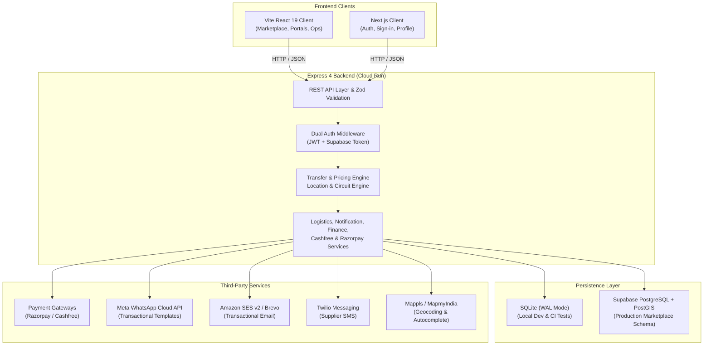
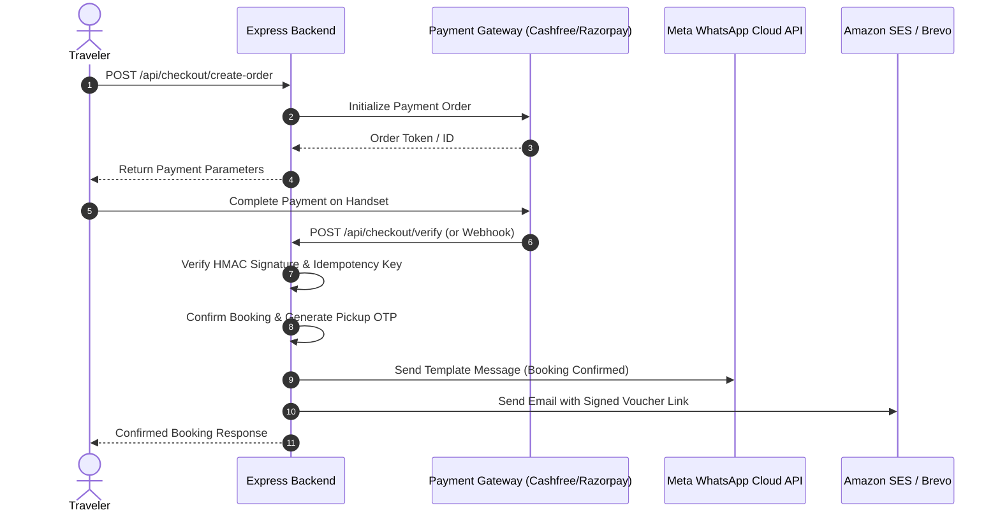
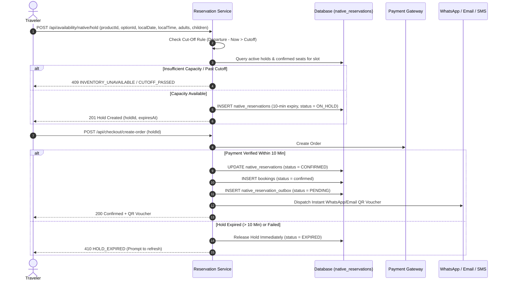
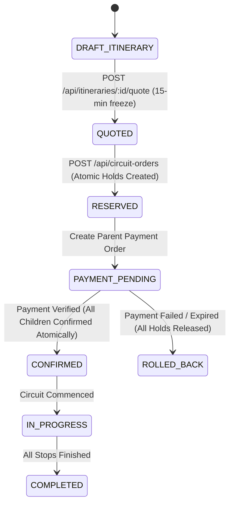

# Technical Architecture: Idea Holiday

> **Summary:** How the clients, Express API, dual database, workers and providers fit together, with request flows.
> **Read when:** a change crosses layers or you need the big picture. For file locations use CODEMAP.md.

## High-Level Architecture Overview

Idea Holiday is constructed as a modern, decoupled web application featuring a dual-client setup, an Express REST API backend, a dual-engine persistence layer, and integrated third-party communication and payment providers.



---

## 1. Client Architecture

### 1.1 Vite React 19 Client (`/frontend`)
- **Technology**: React 19, Vite, Tailwind CSS, Lucide React, QRcode.
- **Role**: Primary marketplace client serving travelers, tour operators, fleet suppliers, ground ops staff, and platform administrators.
- **Routing**: Client-side single page application with lazy-loaded workspaces to meet performance budgets (`< 225 KiB` initial JS entry).
- **Core Views**:
  - Traveler: `/`, `/search`, `/activity/:id`, `/circuit-planner`, `/checkout`, `/circuit-checkout/:id`, `/my-trips`, `/my-reviews`.
  - Supplier: `/supplier/dashboard`, `/supplier/listings`, `/supplier/builder`, `/supplier/transfer-builder`, `/supplier/bookings`, `/supplier/coverage`.
  - Operations: `/ops/live-trip-board`, `/ops/circuits`, `/ops/notifications`, `/ops/support`.
  - Admin: `/admin/overview`, `/admin/suppliers`, `/admin/products`, `/admin/coverage`, `/admin/finance`, `/admin/quality`, `/admin/analytics`.

### 1.2 Next.js Client (`/app`)
- **Technology**: Next.js (App Router), React, Supabase Auth Helpers.
- **Role**: Dedicated authentication and sign-in experiences (Email/Password, Google OAuth), session callbacks, and guest document link landing.

---

## 2. Backend Architecture (`/backend`)

### 2.1 Server Core
- **Technology**: Node.js (ESM), Express 4.19.
- **Request Lifecycle**:
  1. `requestBoundary`: Rejects payloads exceeding 100 KiB, deep nesting (>10 levels), or prototype-pollution keys (`__proto__`, `prototype`, `constructor`).
  2. `helmet`: Enforces strict HTTP security headers and RFC 9116 security policies.
  3. `cors`: Dynamic allowlist restricted to authorized origins.
  4. `express-rate-limit`: Rate limits public endpoints with 429 structured JSON responses.
  5. `authenticate` / `optionalAuthMiddleware`: Verifies bearer credentials.
  6. `validateBody` / `validateQuery` / `validateParams`: Enforces Zod schemas with sanitization.
  7. Route Handlers & Domain Services.
  8. Global Error Handler & Audit Logger.

---

## 3. Persistence Layer

### 3.1 Dual-Engine Strategy
The repository features an abstracted database interface allowing seamless switching between engines via the `DATABASE_ENGINE` environment variable:

| Feature | Local Development & CI | Production Deployment |
| :--- | :--- | :--- |
| **Engine** | **SQLite** (`better-sqlite3`) | **Supabase PostgreSQL** (`pg`) |
| **Driver** | Synchronous embedded database | Pooled PostgreSQL client |
| **Location** | `backend/wanderindia.db` | Supabase Cloud Database |
| **Spatial Engine** | In-memory ray-casting Point-in-Polygon | PostGIS (`ST_Contains`, `ST_GeomFromGeoJSON`) |
| **Migrations** | Custom dual-engine SQL runner (`scripts/migrate.js`) | Versioned SQL scripts in `backend/migrations/` |
| **Journaling** | WAL (Write-Ahead Logging) | Standard WAL / ACID guarantees |

---

## 4. Authentication & Authorization Architecture

The platform supports a dual-token authentication scheme:
1. **Idea Holiday JWT**: Issued directly by `/api/auth/login` and `/api/auth/signup`, signed using `JWT_SECRET` (HS256), containing `{ id, email, role, supplier_id }`.
2. **Supabase Access Token**: Bearer JWT issued by Supabase Auth (e.g. Google Sign-in). The backend verifies it via `supabase.auth.getUser(token)`, then queries its own database to resolve the user's role, permissions, and supplier linkage.

### Ecosystem Roles & Scope Matrix
- `TRAVELER`: Access to own bookings, reviews, support cases, wishlist, wallet, and circuit plans.
- `SUPPLIER`: Access strictly scoped to own supplier profile, driver roster, listings, assignments, and payouts (`WHERE supplier_id = ?`).
- `STAFF` (Operations): Access to all driver dispatches, staff tasks, live trip boards, SLA timeout processors, circuit review queues, and notification logs.
- `ADMIN`: Full platform access including KYB approvals, commission overrides, finance settlements, review moderation, and analytics.

---

## 5. Reservation engine

Seat inventory, holds, seasonal rates, calendar overrides, shared resources,
unit types and the OCTo provider boundary are documented in full in
[`RESERVATION_ENGINE.md`](RESERVATION_ENGINE.md). In architectural terms:

- `nativeInventoryService.js` owns capacity, pricing resolution and holds.
- `reservationProviders.js` is the provider boundary — `NATIVE` today, external
  ResTech adapters later — so the rest of the system never calls a provider directly.
- `reservationOutboxService.js` delivers confirmations from a durable outbox
  written in the same transaction as seat confirmation.
- `channelManagerService.js` and `services/channels/` import products from
  external systems into the same catalog.

## 6. Third-Party Service Integrations



1. **Cashfree Payments & SecureID**:
   - Primary payment gateway supporting UPI, Netbanking, Debit/Credit Cards.
   - SecureID integration for automated supplier KYB bank account and PAN/GST verification.
2. **Razorpay Payments**:
   - Alternative payment gateway supporting instant UPI QR, cards, and netbanking.
3. **Meta WhatsApp Cloud API**:
   - Production transactional messaging via WhatsApp Graph API (`v22.0`).
   - Phone ID: `1091999820653021`, App ID: `1488217219329539`, WABA: `794585599913804`.
4. **Amazon SES v2 / Brevo**:
   - High-deliverability transactional email delivery with custom HTML templates.
5. **Twilio Messaging**:
   - Optional SMS dispatch for urgent supplier assignments when data connection is unavailable.
6. **Mappls / MapmyIndia**:
   - Geocoding and location autocomplete fallback for Indian addresses and landmarks.

---

## 7. Deployment & Infrastructure

- **Containerization**: Dockerfile building a standalone Node.js production image with pruned production dependencies.
- **Compute Runtime**: Google Cloud Run (2 vCPU, 2 GiB RAM, auto-scaling to zero or min instances).
- **Secrets Management**: Secrets injected at runtime from Google Secret Manager (`DATABASE_URL`, `JWT_SECRET`, `WHATSAPP_ACCESS_TOKEN`, `RAZORPAY_KEY_SECRET`, `CASHFREE_SECRET_KEY`).
- **CI/CD Pipeline**: GitHub Actions (`.github/workflows/ci.yml` and `deploy.yml`) running test coverage gates, E2E browser journeys, Vite bundle budget checks, and automated blue-green deployments.

---

## 8. Core operational flows

### 8.1 Native Reservation, Supplier Extranet & Temporary Hold Flow
To digitize manual/offline tour operators and eliminate double-booking during checkout, the platform implements a 3-step real-time reservation architecture:

1. **Supplier Extranet & Inventory Builder**:
   - Direct suppliers define operating days, departure time slots (e.g., `09:00 AM`, `02:00 PM`), maximum seats per slot, and Adult/Child pricing tiers.
   - **Automated Cut-Off Rules**: Suppliers configure cut-off rules in minutes (`cutoff_minutes`, e.g., `120` = stop accepting bookings 2 hours before departure start time). The engine automatically closes departures past this threshold.
   - **Blackouts**: Calendar dates can be blacked out without cancelling existing confirmed bookings.
2. **Dynamic Seat Allocation & 10-Minute Cart Lock**:
   - When a user enters checkout, the engine creates a 10-minute temporary seat hold (`native_reservations`).
   - While on hold, those seats are locked from other buyers:
     $$\text{Vacancies} = \text{Configured Max Capacity} - \text{Confirmed Seats} - \text{Active Holds}$$
   - If payment fails, times out, or the user cancels, the hold is released immediately.
   - Upon verified payment, the hold transitions to `CONFIRMED` inside an atomic transaction without double-deduction.
3. **Instant Confirmation & QR Digital Vouchers**:
   - Verified bookings immediately generate a digital voucher with an embedded QR code pointing to the secure booking view.
   - The platform dispatches instant transactional notifications via WhatsApp (Meta Cloud API), Email (SES / Brevo), and optional SMS (Twilio).
4. **OCTo Standard Provider Boundary**:
   - `backend/src/services/reservationProviders.js` exposes standard OCTo methods (`availability`, `reserve`, `confirm`, `release`).
   - The `NATIVE` provider powers Phase 1 direct extranet suppliers. In Phase 2, external connectors for Bókun and FareHarbor plug into this same interface without database changes.



---

### 8.2 Grouped Circuit Ordering & Atomic Multi-Supplier Rollback
Travelers can assemble multi-day custom journeys across multiple independent suppliers. The system guarantees atomic confirmation:



- **All-or-Nothing Guarantee**: If any supplier's capacity becomes unavailable before payment, the entire circuit reservation is declined. No traveler is left with a half-booked itinerary.
- **Grouped Payment**: One transaction reference covers all child bookings; each child booking maintains its own independent supplier payout record.

---

### 8.3 Pickup OTP Cryptographic Security Lifecycle

To prevent driver imposters and ensure traveler safety, the pickup handshake follows strict cryptographic separation:

```mermaid
flowchart TD
    Create["Payment Confirmed"] --> GenOTP["Generate 6-digit random code<br/>(e.g. '849201')"]
    GenOTP --> Hash["Compute SHA-256 Hash<br/>(Stored in 'pickup_otp_hash')"]
    GenOTP --> Encrypt["Encrypt via AES-256-GCM<br/>(Stored in 'pickup_otp_encrypted')"]
    Hash --> DB[(Database)]
    Encrypt --> DB
    
    subgraph AccessControls ["API Boundary"]
        DB -.-> TravelerAPI["Traveler API / My Trips<br/>(Decrypted & Displayed)"]
        DB -.x OpsAPI["Staff / Supplier / Driver APIs<br/>(Secret strictly redacted)"]
    end
    
    subgraph PickupVerification ["Pickup Handshake"]
        TravelerAPI --> TravelerPhone["Traveler shares code verbally<br/>AFTER verifying vehicle plate"]
        TravelerPhone --> DriverInput["Driver inputs code into portal"]
        DriverInput --> VerifyAPI["POST /api/bookings/:id/verify-pickup-otp"]
        VerifyAPI --> CheckAttempts{"Attempts < 5?"}
        CheckAttempts -- No --> Lock["Lock Verification<br/>(Status = OTP_LOCKED)"]
        CheckAttempts -- Yes --> CompareHash{"SHA-256(Input) == Hash?"}
        CompareHash -- Match --> Success["Trip Status = IN_PROGRESS<br/>Attempts Reset"]
        CompareHash -- Mismatch --> Increment["Increment Attempt Count<br/>Return Remaining Attempts"]
    end
```

---

### 8.4 Background Jobs & SLA Monitors
1. **Supplier Response SLA (24 Hours)**:
   - Evaluated via `processExpiredSupplierAssignments()` in `assignmentSlaService.js`.
   - When a supplier fails to confirm an assigned booking within their deadline, the booking is automatically transitioned to `REALLOCATION_PENDING` and a high-priority `staff_tasks` row is created for Operations.
2. **Circuit Reschedule Reconfirmation SLA**:
   - Evaluated via `processExpiredCircuitReconfirmations()` in `circuitOrchestrationService.js`.
   - When a traveler requests a circuit reschedule, every affected supplier has 24 hours to accept new dates. Rejections or timeouts prevent single-stop fragmentation and escalate the parent order to Operations review.
3. **Automated Reminders Scanner**:
   - Runs periodic scans (`triggerAutomatedReminders()`):
     - **24-Hour Pre-Trip Reminder**: Sends WhatsApp and email alerts containing driver details and vehicle registration to travelers departing in 24–36 hours.
     - **Post-Trip Review Invitation**: Sends feedback requests with direct review links to travelers whose bookings were marked `completed` within the last 24 hours.
   - Enforces strict idempotency keys (`bookingId:PRE_TRIP_REMINDER:24H` and `bookingId:POST_TRIP_REVIEW_INVITE`), ensuring no traveler is messaged twice.
4. **Native Reservation Outbox Worker**:
   - Runs every 5 seconds via `processReservationOutbox()` to guarantee at-least-once delivery of notifications for instant bookings.

---

### 8.5 Security Boundaries & Sanitization
- **Logging Redaction**: Winston logger recursively strips sensitive keys (`password`, `token`, `otp`, `pickup_otp`, `bank_account`, `pan_number`, `gstin`, `credit_card`).
- **Data Boundary Protection**: Deeply nested JSON payloads (>10 levels) or payloads containing prototype keys (`__proto__`) are terminated immediately at the Express middleware layer with HTTP 400.
