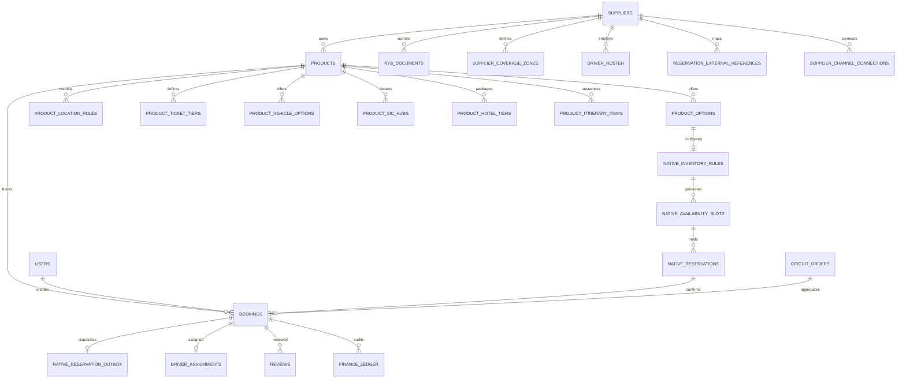

# Data Model: Idea Holiday

## Database Engine Architecture
The marketplace supports a **dual-engine data architecture**:
1. **SQLite (WAL Mode)**: Primary for local development, integration testing, and single-container deployments (`backend/wanderindia.db`).
2. **PostgreSQL + PostGIS**: Primary for production cloud deployments (Supabase `marketplace` schema).

The schema is defined in `backend/src/db.js` and mirrored in `backend/src/supabase_schema.sql` with versioned migrations tracked in `_schema_migrations`.

---

## 1. Core Entity Relationship Diagram

---

## 2. Table Specifications

### 2.1 Users & Authentication (`users`)
| Column | Type | Constraints | Description |
| :--- | :--- | :--- | :--- |
| `id` | TEXT / UUID | PRIMARY KEY | Unique user identifier (`usr_...`). |
| `email` | TEXT | UNIQUE, NOT NULL | Account email (stored in lowercase). |
| `password_hash` | TEXT | NOT NULL | Salted PBKDF2/scrypt password hash. |
| `name` | TEXT | NOT NULL | Full name of the user. |
| `phone` | TEXT | | Normalized mobile number (E.164 without leading `+`). |
| `role` | TEXT | DEFAULT 'TRAVELER' | `TRAVELER`, `SUPPLIER`, `STAFF`, `ADMIN`. |
| `supplier_id` | TEXT | REFERENCES suppliers(id) | Associated supplier ID if user is a supplier operator. |
| `created_at` | TIMESTAMP | DEFAULT NOW | Record creation timestamp. |

### 2.2 Suppliers & KYB (`suppliers`, `kyb_documents`)
- **`suppliers`**:
  - `id`: Primary key (`sup_...`).
  - `supplier_code`: Unique vendor alphanumeric code (`SU-XXXXXX`).
  - `company_name`: Legal registered entity name.
  - `contact_name`, `email`, `phone`, `city`, `state`.
  - `gstin`, `pan_number`: Legal tax identifiers.
  - `kyb_status`: `PENDING`, `APPROVED`, `REJECTED`. Only `APPROVED` vendors can publish listings.
  - `commission_rate`: Real percentage (default 18.0%).
  - `payout_bank_details`: JSON object with `{ account_number, ifsc, bank_name, beneficiary_name, upi_id }`.
  - `rating`: Float (default 4.8).
- **`kyb_documents`**:
  - `id`: Primary key (`kyb_...`).
  - `supplier_id`: Foreign key to `suppliers(id)`.
  - `doc_type`: `AADHAAR`, `PAN`, `GSTIN`, `COMMERCIAL_PERMIT`.
  - `doc_url`: Encrypted storage link.
  - `status`: `PENDING`, `APPROVED`, `REJECTED`.

### 2.3 Product Catalog & 5 Product Types Architecture
- **`products`**:
  - `id`: Primary key (`prd_...`).
  - `supplier_id`: Foreign key to `suppliers(id)`.
  - `title`, `slug`, `description`, `city`, `state`, `category`.
  - `product_type`: `TRANSFER`, `TOUR`, `PACKAGE`, `ATTRACTION`, `EXPERIENCE` — the
    values `POST /products/v2` accepts. Older rows may still hold the legacy
    `DAY_TOUR` (= `TOUR`) and `MULTI_DAY_PACKAGE` (= `PACKAGE`); code matches both.
  - `product_sub_type`: `WITH_HOTEL`, `WITHOUT_HOTEL`, `SIC`, `PRIVATE`,
    `AIRPORT_RAILWAY`, `INTERCITY_HOTEL`, `CITY_TO_CITY`, `TICKET_ONLY`,
    `TICKET_SIC`, `TICKET_PRIVATE`.
  - `product_sub_type`: Subcategory discriminator (e.g. `AIRPORT_TRANSFER`, `INTERCITY_TRANSFER`, `PRIVATE_TOUR`, `SIC_TOUR`, `WITH_HOTEL`, `CAB_ONLY`, `THEME_PARK`, `MONUMENT`, `WATER_SPORTS`, `CULINARY`).
  - `essential_info`: JSON array of important instructions.
  - `booking_mode`: `INSTANT` or `REQUEST`.
  - `min_advance_hours`: Minimum booking notice required (default 4).
  - `min_pax`, `max_pax`: Allowed guest party bounds.
  - `languages`: JSON array of spoken languages.
  - `duration_hours`, `duration_days`: Duration metrics.
  - `base_price`: Starting price in INR.
  - `is_published`: Boolean flag controlling marketplace visibility.
  - `confirmation_type`: `INSTANT` or `MANUAL`.

- **`product_ticket_tiers`** (Attraction Tickets & Experiential Tours):
  - `id`: Primary key (`ptt_...`).
  - `product_id`: References `products(id)`.
  - `tier_name`: Passenger category (`Adult`, `Child`, `Senior`, `Infant`).
  - `age_min`, `age_max`: Age bounds.
  - `price_inr`: Fare per ticket unit.
  - `is_free`: 1 if zero charge (e.g. infants).
  - `sort_order`, `is_active`.

- **`product_vehicle_options`** (Transfers & Private Tours):
  - `id`: Primary key (`pvo_...`).
  - `product_id`: References `products(id)`.
  - `vehicle_type`: `SEDAN`, `SUV`, `TEMPO`, `MINI_BUS`, `BUS`.
  - `label`: Customer-facing label (e.g. `Sedan (up to 4 pax)`).
  - `max_pax`, `max_luggage`.
  - `price_inr`: Vehicle price.
  - `is_recommended`, `sort_order`, `is_active`.

- **`product_sic_hubs`** (Seat-In-Coach Shared Tours & Attractions):
  - `id`: Primary key (`psh_...`).
  - `product_id`: References `products(id)`.
  - `hub_name`, `hub_address`, `lat`, `lng`.
  - `departure_time`: 24-hour format string (e.g. `09:00`).
  - `capacity`: Maximum seats per slot per hub.
  - `sort_order`, `is_active`.

- **`product_hotel_tiers`** (Multi-Day Packages WITH_HOTEL):
  - `id`: Primary key (`pht_...`).
  - `product_id`: References `products(id)`.
  - `tier_name`: Accommodation tier (`3-Star`, `4-Star`, `5-Star`).
  - `example_properties`: JSON array of example hotels.
  - `price_per_person_per_night_inr`: Tier rate per traveler per night.
  - `is_recommended`, `sort_order`, `is_active`.

- **`product_itinerary_items`** (Unified Day-Wise / Hourly Itineraries):
  - `id`: Primary key (`pii_...`).
  - `product_id`: References `products(id)`.
  - `day_number`: 1, 2, 3... for multi-day, 0 for single-day time stops.
  - `time_label`: e.g. `Day 1` or `09:00am`.
  - `title`, `description`, `location`, `duration_text`, `icon`, `sort_order`.

- **`product_options`**: Operational options (`code`, `name`, `pickup_option_type`, `confirmation_type`, `available_start_times`, `locations`).
- **`product_location_rules`**: Links products to canonical anchor locations (`AIRPORT`, `HOTEL_ZONE`, `CITY_BOUNDARY`).

### 2.4 Geo-Fencing & Coverage (`supplier_coverage_zones` / `geo_fences`)
- `id`: Primary key.
- `supplier_id`: Foreign key to `suppliers(id)`.
- `zone_name`, `city`, `state`.
- `zone_type`: `POINT_RADIUS` or `POLYGON`.
- `center_lat`, `center_lng`, `radius_km`: For circular radius coverage.
- `polygon_geojson`: PostGIS polygon geometry or JSON array of `[[lat, lng], ...]` vertices.

### 2.5 Native Inventory & Seat Reservations (Phase 1 Engine)
- **`native_inventory_rules`**:
  - `option_id`: Primary key, references `product_options(id)`.
  - `product_id`: References `products(id)`.
  - `operating_days`: JSON array of day integers (`[0, 1, 2, 3, 4, 5, 6]` where 0 = Sunday).
  - `departure_times`: JSON array of time strings (e.g. `["09:00", "14:00"]`).
  - `capacity`: Maximum seat count per departure.
  - `adult_price`, `child_price`: Unit pricing in INR before tax.
  - `cutoff_minutes`: Notice required before departure (e.g. 120 = 2 hours).
  - `cancellation_hours`: Free-cancellation deadline in hours.
  - `blackout_dates`: JSON array of dates (`["YYYY-MM-DD", ...]`).
  - `time_zone`: Default `Asia/Kolkata`.
  - `provider`: Default `NATIVE`.
  - `min_party_size`: Minimum travelers required for a departure to run (default 1).
  - `max_party_size`: Maximum travelers per booking; `0` means no cap.
  - `unit_prices`: JSON map of extended unit rates, e.g. `{"SENIOR": 700, "INFANT": 0}`.
    `ADULT` and `CHILD` always come from `adult_price`/`child_price`; a unit type
    absent from this map is not sold.

- **`native_price_schedules`** (seasonal rates, migration `021`):
  - `id`: Primary key.
  - `option_id`, `product_id`: Owning option and product.
  - `label`: Supplier-facing name (e.g. `"Christmas week"`).
  - `starts_on`, `ends_on`: Inclusive date range the rate covers.
  - `weekdays`: JSON array of day integers the rate applies to.
  - `adult_price`, `child_price`: Rate in INR before tax.
  - `priority`: Higher wins when ranges overlap; ties break on newest row.
  - Resolution: highest-priority matching schedule, else the option's base
    `adult_price`/`child_price`.

- **`native_slot_overrides`** (calendar control, migration `021`):
  - `id`: Primary key, `optionId:date:time`.
  - `local_date`: Date the override applies to.
  - `local_time`: A single departure, or empty string for the whole day.
  - `capacity`: Seat count for that departure; `NULL` inherits the rule capacity.
  - `closed`: `1` withdraws the departure from sale.
  - `note`: Supplier reason, surfaced on the availability response.
  - Resolution: exact `(date, time)` override, then whole-day override, then the
    weekly operating rules and blackout dates.

- **`native_resources`** / **`native_resource_options`** (shared capacity, migration `023`):
  - A resource is one real vehicle, boat or guide with its own `capacity`.
  - `native_resource_options` links it many-to-many to the options drawing on it.
  - A departure's vacancies are the smallest of its own pool and every linked
    resource, counted per `(local_date, local_time)`, so the same van is free
    again at a later departure.
  - `native_inventory_rules.seatless_units`: unit types that bill but consume no
    seat (infant on a lap). Excluded from the `adults`/`children` seat counts,
    still recorded in `booking_unit_items`.

- **`booking_unit_items`** (billed unit breakdown, migration `022`):
  - `booking_id`: References `bookings(id)`; unique per `(booking_id, unit_type)`.
  - `unit_type`: One of `ADULT`, `CHILD`, `INFANT`, `SENIOR`, `YOUTH`.
  - `quantity`, `unit_price_inr`: Travelers on that line and the price frozen at booking.
  - **Additive only.** `bookings.adults` / `bookings.children` remain the
    canonical seat counts read by capacity, dispatch, vouchers and notifications.
    `ADULT`/`SENIOR`/`YOUTH` roll up into adults; `CHILD`/`INFANT` into children.
    Every unit occupies exactly one seat.

- **`native_availability_slots`**:
  - `id`: Primary key (`slot_...`).
  - `product_id`: References `products(id)`.
  - `option_id`: References `native_inventory_rules(option_id)`.
  - `local_date`: ISO date (`YYYY-MM-DD`).
  - `local_time`: Departure time (`HH:MM`).
  - `capacity`: Slot seat limit.
  - `closed`: 1 if manually closed or outside operating schedule.
  - `UNIQUE(option_id, local_date, local_time)`.

- **`native_reservations`**:
  - `id`: Primary key (`res_...`).
  - `availability_slot`: References `native_availability_slots(id)`.
  - `owner_id`: User ID holding the reservation.
  - `booking_id`: References `bookings(id)` upon checkout completion.
  - `request_key`: Idempotency key scoped to owner.
  - `adults`: Adult seat count (> 0).
  - `children`: Child seat count (>= 0).
  - `status`: `ON_HOLD`, `CONFIRMED`, `EXPIRED`, `CANCELLED`.
  - `utc_expires_at`: 10-minute hold deadline timestamp.
  - `pricing_snapshot`: Frozen JSON pricing details.
  - `UNIQUE(owner_id, request_key)`.

- **`native_reservation_outbox`**:
  - `booking_id`: Primary key, references `bookings(id)`.
  - `status`: `PENDING`, `PROCESSING`, `COMPLETED`, `FAILED`.
  - `attempts`, `available_at`, `lease_until`, `last_error`, `completed_at`.

- **`reservation_external_references`** (OCTO ResTech Foundation):
  - `provider`: `NATIVE`, or external adapters (`BOKUN`, `FAREHARBOR`, `BOOKINGKIT`, `TOURCMS`, `ACTIVITAR`, `ANCHOR`, `OCTO_GENERIC`).
  - `resource_type`: `PRODUCT`, `OPTION`, `AVAILABILITY`, `BOOKING`, `UNIT`.
  - `internal_id`, `external_id`, `supplier_id`.
  - `PRIMARY KEY(provider, supplier_id, resource_type, internal_id)`.

- **`supplier_channel_connections`** (External ResTech & OCTo Ingestion):
  - `id`: Primary key (`ch_...`).
  - `supplier_id`: Foreign key referencing `suppliers(id)`.
  - `channel_name`: `BOKUN`, `FAREHARBOR`, `BOOKINGKIT`, `TOURCMS`, `ACTIVITAR`, `ANCHOR`, `OCTO_GENERIC`.
  - `channel_title`, `endpoint_url`, `credentials_json` (encrypted / stored credentials).
  - `status`: `ACTIVE`, `DISCONNECTED`, `ERROR`.
  - `last_sync_at`, `last_sync_status`, `last_error`.
  - `created_at`, `updated_at`.

### 2.6 Bookings & Dispatch (`bookings`, `driver_assignments`)
- **`bookings`**:
  - `id`: Primary key (`bk_...`).
  - `ref`: Short customer-facing booking reference (`IH-XXXXXX`).
  - `product_id`, `supplier_id`, `user_id`.
  - `traveler_name`, `traveler_email`, `traveler_phone`.
  - `activity_date`, `pickup_time`, `pickup_location`, `drop_location`.
  - `total_price`, `currency` (INR), `commission_amount`, `supplier_payout_amount`.
  - `payment_status`: `PENDING`, `COMPLETED`, `REFUNDED`, `PARTIALLY_REFUNDED`.
  - `booking_status`: `pending_payment`, `confirmed`, `driver_assigned`, `in_progress`, `completed`, `cancelled`.
  - `pickup_otp_hash`: SHA-256 hash of the 6-digit pickup code for constant-time verification.
  - `pickup_otp_encrypted`: AES-256-GCM ciphertext decrypted only for the traveler view.
  - `pickup_otp_attempts`: Failed verification count (locks at 5).
- **`driver_assignments`**:
  - `id`: Primary key.
  - `booking_id`: Foreign key to `bookings(id)`.
  - `driver_name`, `driver_phone`.
  - `vehicle_model`, `vehicle_number`.
  - `assignment_status`: `ASSIGNED`, `EN_ROUTE`, `ARRIVED`, `COMPLETED`.

### 2.7 Circuit Orders (`circuit_quotes`, `circuit_orders`, `circuit_requests`)
- **`circuit_quotes`**:
  - `id`: Primary key (`cq_...`).
  - `user_id`, `itinerary_id`.
  - `total_amount`, `currency`.
  - `quote_payload`: JSON snapshot of all re-priced stops and line items.
  - `expires_at`: 15-minute freeze timestamp.
  - `consumed_at`: Timestamp when turned into an order.
- **`circuit_orders`**:
  - `id`: Primary key (`co_...`).
  - `ref`: Parent circuit reference (`CO-XXXXXX`).
  - `quote_id`: Foreign key to `circuit_quotes(id)`.
  - `payment_provider`: `CASHFREE`, `RAZORPAY`, `DEMO`.
  - `payment_order_id`, `payment_reference`.
  - `status`: `PENDING_PAYMENT`, `CONFIRMED`, `CANCELLED`, `COMPLETED`.
  - `line_items`: JSON array linking child booking IDs and prices.

### 2.8 Finance, Ledger & Payouts (`finance_ledger`, `supplier_payouts`, `refund_records`)
- **`finance_ledger`**:
  - Immutable audit trail recording debits/credits for payments, platform commission, supplier earnings, refunds, and bank settlements.
- **`supplier_payouts`**:
  - `status`: `SCHEDULED`, `BATCHED`, `PROCESSED`, `RECONCILED`.
  - Payouts remain in `SCHEDULED` until the trip is verified completed via OTP.
- **`refund_records`**:
  - Tracks refund amount, calculation rule, payment gateway refund ID, and approval status.

### 2.9 Operations & Notifications (`staff_tasks`, `notification_deliveries`, `whatsapp_logs`)
- **`staff_tasks`**: Operational tasks generated for SLA timeouts, unassigned trips, OTP lockouts, and review moderation.
- **`notification_deliveries`**: Unified audit ledger for email, SMS, and WhatsApp messages with idempotency keys (`event_key`).

---

## 3. Sensitive Data & Security Controls
1. **Pickup OTPs**:
   - Never stored in plaintext.
   - Verified strictly by comparing `SHA-256(userInput)` against `pickup_otp_hash`.
   - Decrypted only by `withoutPickupOtpSecrets` filter when requested by the owning traveler.
2. **Passwords**: Salted and hashed using strong cryptographic hashes before insertion into `users`.
3. **Financial Data**: Bank account details in `suppliers.payout_bank_details` are redacted in standard API outputs.
