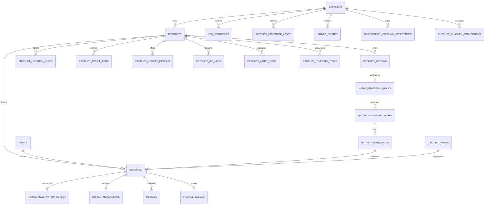

# Data Model: Idea Holiday

> **Summary:** Tables, key columns and relationships.
> **Read when:** adding or changing schema or queries. Large: `grep -n '^##\|^###' docs/DATA_MODEL.md` and read one section.

## Database Engine Architecture
The marketplace supports a **dual-engine data architecture**:
1. **SQLite (WAL Mode)**: Primary for local development, integration testing, and single-container deployments (`backend/wanderindia.db`).
2. **PostgreSQL + PostGIS**: Primary for production cloud deployments (Supabase `marketplace` schema).

**Schema source of truth: `backend/migrations/`.** `runPendingMigrations()` applies them at startup on both engines and records each file in `_schema_migrations`.
- `backend/src/db.js` also bootstraps the original tables on SQLite only. Don't add schema there.
- `backend/src/supabase_schema.sql` and `supabase/migrations/` are legacy and never executed (see `supabase/README.md`).

---

## 1. Core Entity Relationship Diagram

---

## 2. Table Specifications

### 2.1 Users & Authentication (`users`)
| Column | Type | Constraints | Description |
| :--- | :--- | :--- | :--- |
| `id` | TEXT / UUID | PRIMARY KEY | Unique user identifier (`usr_...`). |
| `email` | TEXT | UNIQUE, NOT NULL | Account email (stored in lowercase). |
| `password_hash` | TEXT | NOT NULL | Salted PBKDF2/scrypt password hash. |
| `name` | TEXT | NOT NULL | Full name of the user. |
| `phone` | TEXT | | Mobile number as E.164 with `+` (`+66812345678`), ADR 022. |
| `role` | TEXT | DEFAULT 'TRAVELER' | `TRAVELER`, `SUPPLIER`, `STAFF`, `ADMIN`. |
| _(no `supplier_id`)_ | — | — | A `SUPPLIER` login is linked to its supplier row by matching `users.email` to `suppliers.email` (`middleware/auth.js`), not by a column on `users`. |
| `created_at` | TIMESTAMP | DEFAULT NOW | Record creation timestamp. |

### 2.2 Suppliers & KYB (`suppliers`, `kyb_documents`)
- **`suppliers`**:
  - `id`: Primary key (`sup_...`).
  - `supplier_code`: Unique vendor alphanumeric code (`SU-XXXXXX`).
  - `company_name`: Legal registered entity name.
  - `contact_name`, `email`, `phone`, `city`, `state`.
  - `gstin`, `pan_number`: Legal tax identifiers.
  - `kyb_status`: `PENDING`, `APPROVED`, `REJECTED`. Only `APPROVED` vendors can publish listings.
  - `supplier_kind` (migration 050): `BUSINESS` (default) or `INDIVIDUAL_OWNER` — one person in India with one or more vehicles and no GSTIN. Picks the KYB document list (`supplierKybRules`, ADR 024).
  - `commission_rate`: Legacy percentage, no longer used to price bookings.
  - `commission_override_rate`: The supplier's own commission %, or `NULL` for the platform default (BUSINESS_RULES §3.2).
  - `payout_bank_details`: JSON object with `{ account_number, ifsc, bank_name, beneficiary_name, upi_id }`.
  - `rating`: Float, `NULL` until a verified review exists (see BUSINESS_RULES §9).
- **`kyb_documents`**:
  - `id`: Primary key (`kyb_...`).
  - `supplier_id`: Foreign key to `suppliers(id)`.
  - `doc_type`: `AADHAAR`, `PAN`, `GSTIN`, `COMMERCIAL_PERMIT`.
  - `doc_url`: Encrypted storage link.
  - `status`: `PENDING`, `APPROVED`, `REJECTED`.

### 2.3 Product Catalog & 5 Product Types Architecture
- **`products`**:
  - `id`: Primary key (`prd_...`).
  - `supplier_id`: Foreign key to `suppliers(id)`.
  - `title`, `slug`, `description`, `city`, `state`, `category`.
  - `product_type`: `TRANSFER`, `TOUR`, `PACKAGE`, `ATTRACTION`, `EXPERIENCE` — the
    values `POST /products/v2` accepts. Older rows may still hold the legacy
    `DAY_TOUR` (= `TOUR`) and `MULTI_DAY_PACKAGE` (= `PACKAGE`); code matches both.
  - `product_sub_type`: `WITH_HOTEL`, `WITHOUT_HOTEL`, `SIC`, `PRIVATE`,
    `AIRPORT_RAILWAY`, `INTERCITY_HOTEL`, `CITY_TO_CITY`, `TICKET_ONLY`,
    `TICKET_SIC`, `TICKET_PRIVATE`.
  - `product_sub_type`: Subcategory discriminator (e.g. `AIRPORT_TRANSFER`, `INTERCITY_TRANSFER`, `PRIVATE_TOUR`, `SIC_TOUR`, `WITH_HOTEL`, `CAB_ONLY`, `THEME_PARK`, `MONUMENT`, `WATER_SPORTS`, `CULINARY`).
  - `essential_info`: JSON array of important instructions.
  - `booking_mode`: `INSTANT` or `REQUEST`.
  - `min_advance_hours`: Minimum booking notice required (default 4).
  - `min_pax`, `max_pax`: Allowed guest party bounds.
  - `languages`: JSON array of spoken languages.
  - `duration_hours`, `duration_days`: Duration metrics.
  - `base_price`: Starting price in INR.
  - `is_published`: Boolean flag controlling marketplace visibility.
  - `confirmation_type`: `INSTANT` or `MANUAL`.

- **`product_ticket_tiers`** (Attraction Tickets & Experiential Tours):
  - `id`: Primary key (`ptt_...`).
  - `product_id`: References `products(id)`.
  - `tier_name`: Passenger category (`Adult`, `Child`, `Senior`, `Infant`).
  - `age_min`, `age_max`: Age bounds.
  - `price_inr`: Fare per ticket unit.
  - `is_free`: 1 if zero charge (e.g. infants).
  - `sort_order`, `is_active`.

- **`product_vehicle_options`** (Transfers & Private Tours):
  - `id`: Primary key (`pvo_...`).
  - `product_id`: References `products(id)`.
  - `vehicle_type`: `SEDAN`, `SUV`, `TEMPO`, `MINI_BUS`, `BUS`.
  - `label`: Customer-facing label (e.g. `Sedan (up to 4 pax)`).
  - `max_pax`, `max_luggage`.
  - `price_inr`: Vehicle price.
  - `is_recommended`, `sort_order`, `is_active`.

- **`product_sic_hubs`** (Seat-In-Coach Shared Tours & Attractions):
  - `id`: Primary key (`psh_...`).
  - `product_id`: References `products(id)`.
  - `hub_name`, `hub_address`, `lat`, `lng`.
  - `departure_time`: 24-hour format string (e.g. `09:00`).
  - `capacity`: Maximum seats per slot per hub.
  - `sort_order`, `is_active`.

- **`product_hotel_tiers`** (Multi-Day Packages WITH_HOTEL):
  - `id`: Primary key (`pht_...`).
  - `product_id`: References `products(id)`.
  - `tier_name`: Accommodation tier (`3-Star`, `4-Star`, `5-Star`).
  - `example_properties`: JSON array of example hotels.
  - `price_per_person_per_night_inr`: Tier rate per traveler per night.
  - `is_recommended`, `sort_order`, `is_active`.

- **`product_itinerary_items`** (Unified Day-Wise / Hourly Itineraries):
  - `id`: Primary key (`pii_...`).
  - `product_id`: References `products(id)`.
  - `day_number`: 1, 2, 3... for multi-day, 0 for single-day time stops.
  - `time_label`: e.g. `Day 1` or `09:00am`.
  - `title`, `description`, `location`, `duration_text`, `icon`, `sort_order`.

- **`product_options`**: Operational options (`code`, `name`, `pickup_option_type`, `confirmation_type`, `available_start_times`, `locations`).
- **`product_location_rules`**: Links products to canonical anchor locations (`AIRPORT`, `HOTEL_ZONE`, `CITY_BOUNDARY`).

### 2.4 Geo-Fencing & Coverage (`supplier_coverage_zones` / `geo_fences`)
- `id`: Primary key.
- `supplier_id`: Foreign key to `suppliers(id)`.
- `zone_name`, `city`, `state`.
- `zone_type`: `POINT_RADIUS` or `POLYGON`.
- `center_lat`, `center_lng`, `radius_km`: For circular radius coverage.
- `polygon_geojson`: PostGIS polygon geometry or JSON array of `[[lat, lng], ...]` vertices.

### 2.5 Native Inventory & Seat Reservations (Phase 1 Engine)
- **`native_inventory_rules`**:
  - `option_id`: Primary key, references `product_options(id)`.
  - `product_id`: References `products(id)`.
  - `operating_days`: JSON array of day integers (`[0, 1, 2, 3, 4, 5, 6]` where 0 = Sunday).
  - `departure_times`: JSON array of time strings (e.g. `["09:00", "14:00"]`).
  - `capacity`: Maximum seat count per departure.
  - `adult_price`, `child_price`: Unit pricing in INR before tax.
  - `cutoff_minutes`: Notice required before departure (e.g. 120 = 2 hours).
  - `cancellation_hours`: Free-cancellation deadline in hours.
  - `blackout_dates`: JSON array of dates (`["YYYY-MM-DD", ...]`).
  - `time_zone`: Default `Asia/Kolkata`.
  - `provider`: Default `NATIVE`.
  - `min_party_size`: Minimum travelers required for a departure to run (default 1).
  - `max_party_size`: Maximum travelers per booking; `0` means no cap.
  - `unit_prices`: JSON map of extended unit rates, e.g. `{"SENIOR": 700, "INFANT": 0}`.
    `ADULT` and `CHILD` always come from `adult_price`/`child_price`; a unit type
    absent from this map is not sold.

- **`native_price_schedules`** (seasonal rates, migration `021`):
  - `id`: Primary key.
  - `option_id`, `product_id`: Owning option and product.
  - `label`: Supplier-facing name (e.g. `"Christmas week"`).
  - `starts_on`, `ends_on`: Inclusive date range the rate covers.
  - `weekdays`: JSON array of day integers the rate applies to.
  - `adult_price`, `child_price`: Rate in INR before tax.
  - `priority`: Higher wins when ranges overlap; ties break on newest row.
  - Resolution: highest-priority matching schedule, else the option's base
    `adult_price`/`child_price`.

- **`native_slot_overrides`** (calendar control, migration `021`):
  - `id`: Primary key, `optionId:date:time`.
  - `local_date`: Date the override applies to.
  - `local_time`: A single departure, or empty string for the whole day.
  - `capacity`: Seat count for that departure; `NULL` inherits the rule capacity.
  - `closed`: `1` withdraws the departure from sale.
  - `note`: Supplier reason, surfaced on the availability response.
  - Resolution: exact `(date, time)` override, then whole-day override, then the
    weekly operating rules and blackout dates.

- **`native_resources`** / **`native_resource_options`** (shared capacity, migration `023`):
  - A resource is one real vehicle, boat or guide with its own `capacity`.
  - `native_resource_options` links it many-to-many to the options drawing on it.
  - A departure's vacancies are the smallest of its own pool and every linked
    resource, counted per `(local_date, local_time)`, so the same van is free
    again at a later departure.
  - `native_inventory_rules.seatless_units`: unit types that bill but consume no
    seat (infant on a lap). Excluded from the `adults`/`children` seat counts,
    still recorded in `booking_unit_items`.

- **`native_promotions`** (promotional rates, migration `024`):
  - `code`: `NULL` = public promotion; otherwise the traveler must supply it.
  - `discount_type` / `discount_value`: `PERCENT` (0–100) or `FLAT` INR, applied
    per unit price and floored at zero.
  - `book_from` / `book_until`, `travel_from` / `travel_until`: optional windows.
  - `min_lead_hours` / `max_lead_hours`: early-bird and last-minute windows,
    measured from booking time to departure. This is the dimension seasonal rates
    cannot express.
  - `min_party_size`, `max_redemptions` (`0` = unlimited), `priority`, `active`.
  - `native_reservations.promotion_id` records which promotion a hold used;
    redemptions are counted from those rows rather than a counter column.

- **`booking_unit_items`** (billed unit breakdown, migration `022`):
  - `booking_id`: References `bookings(id)`; unique per `(booking_id, unit_type)`.
  - `unit_type`: One of `ADULT`, `CHILD`, `INFANT`, `SENIOR`, `YOUTH`.
  - `quantity`, `unit_price_inr`: Travelers on that line and the price frozen at booking.
  - **Additive only.** `bookings.adults` / `bookings.children` remain the
    canonical seat counts read by capacity, dispatch, vouchers and notifications.
    `ADULT`/`SENIOR`/`YOUTH` roll up into adults; `CHILD`/`INFANT` into children.
    Every unit occupies exactly one seat.

- **`native_availability_slots`**:
  - `id`: Primary key (`slot_...`).
  - `product_id`: References `products(id)`.
  - `option_id`: References `native_inventory_rules(option_id)`.
  - `local_date`: ISO date (`YYYY-MM-DD`).
  - `local_time`: Departure time (`HH:MM`).
  - `capacity`: Slot seat limit.
  - `closed`: 1 if manually closed or outside operating schedule.
  - `UNIQUE(option_id, local_date, local_time)`.

- **`native_reservations`**:
  - `id`: Primary key (`res_...`).
  - `availability_slot`: References `native_availability_slots(id)`.
  - `owner_id`: User ID holding the reservation.
  - `booking_id`: References `bookings(id)` upon checkout completion.
  - `request_key`: Idempotency key scoped to owner.
  - `adults`: Adult seat count (> 0).
  - `children`: Child seat count (>= 0).
  - `status`: `ON_HOLD`, `CONFIRMED`, `EXPIRED`, `CANCELLED`.
  - `utc_expires_at`: 10-minute hold deadline timestamp.
  - `pricing_snapshot`: Frozen JSON pricing details.
  - `UNIQUE(owner_id, request_key)`.

- **`native_reservation_outbox`**:
  - `booking_id`: Primary key, references `bookings(id)`.
  - `status`: `PENDING`, `PROCESSING`, `COMPLETED`, `FAILED`.
  - `attempts`, `available_at`, `lease_until`, `last_error`, `completed_at`.

- **`reservation_external_references`** (OCTO ResTech Foundation):
  - `provider`: `NATIVE`, or external adapters (`BOKUN`, `FAREHARBOR`, `BOOKINGKIT`, `TOURCMS`, `ACTIVITAR`, `ANCHOR`, `OCTO_GENERIC`).
  - `resource_type`: `PRODUCT`, `OPTION`, `AVAILABILITY`, `BOOKING`, `UNIT`.
  - `internal_id`, `external_id`, `supplier_id`.
  - `PRIMARY KEY(provider, supplier_id, resource_type, internal_id)`.

- **`api_partners`** (OCTo reseller keys, migration 061):
  - `id` (`apip_...`), `name`, `supplier_id` (NULL = IdeaHoliday-wide; set = that supplier's products only).
  - `key_hash` (SHA-256, UNIQUE), `key_prefix` (first 12 chars, for recognising a key), `prepaid` (1 = confirmations are PAID), `status` (`ACTIVE`, `REVOKED`), `last_used_at`.
  - `native_reservations.api_partner_id` records which partner made an OCTo hold.

- **`supplier_channel_connections`** (External ResTech & OCTo Ingestion):
  - `id`: Primary key (`ch_...`).
  - `supplier_id`: Foreign key referencing `suppliers(id)`.
  - `channel_name`: `BOKUN`, `FAREHARBOR`, `BOOKINGKIT`, `TOURCMS`, `ACTIVITAR`, `ANCHOR`, `OCTO_GENERIC`.
  - `channel_title`, `endpoint_url`, `credentials_json` (encrypted / stored credentials).
  - `status`: `ACTIVE`, `DISCONNECTED`, `ERROR`.
  - `last_sync_at`, `last_sync_status`, `last_error`.
  - `created_at`, `updated_at`.

### 2.6 Bookings & Dispatch (`bookings`, `driver_assignments`)
- **`bookings`**:
  - `id`: Primary key (`bk_...`).
  - `ref`: Short customer-facing booking reference (`IH-XXXXXX`).
  - `product_id`, `supplier_id`, `user_id`.
  - `traveler_name`, `traveler_email`, `traveler_phone`.
  - `activity_date`, `pickup_time`, `pickup_location`, `drop_location`.
  - `total_price`, `currency` (INR), `commission_amount`, `supplier_payout_amount`.
  - `payment_status`: `PENDING`, `COMPLETED`, `REFUNDED`, `PARTIALLY_REFUNDED`, `REFUNDED_TO_WALLET` (a supplier cancellation, ADR 019).
  - `refunded_to_wallet_inr` (migration 046): what a supplier cancellation put in the traveler's wallet. A later cash refund of that credit leaves the payout at zero.
  - `booking_status`: `pending_payment`, `confirmed`, `driver_assigned`, `in_progress`, `completed`, `cancelled`.
  - `pickup_otp_hash`: SHA-256 hash of the 6-digit pickup code for constant-time verification.
  - `pickup_otp_encrypted`: AES-256-GCM ciphertext decrypted only for the traveler view.
  - `pickup_otp_attempts`: Failed verification count (locks at 5).
  - `attendance_status` (migration 047): `CHECKED_IN`, `NO_SHOW` or `NULL`. Recorded by the supplier; does not change `status` or money ([`SUPPLIER_OPERATIONS.md`](SUPPLIER_OPERATIONS.md)).
  - `checked_in_at`, `checked_in_by`: when attendance was recorded (ISO timestamp) and the user who recorded it.
- **`driver_assignments`**:
  - `id`: Primary key.
  - `booking_id`: Foreign key to `bookings(id)`.
  - `driver_name`, `driver_phone`.
  - `vehicle_model`, `vehicle_number`.
  - `assignment_status`: `ASSIGNED`, `EN_ROUTE`, `ARRIVED`, `COMPLETED`.
  - `last_lat`, `last_lng`, `last_accuracy_m`, `last_speed_kmh`, `last_heading`, `last_location_source` (`DRIVER` | `OPS`), `last_location_at`: the newest driver position (migration 035). Cleared after 30 days.
- **`supplier_drivers`**: a supplier's fleet, one row per driver and vehicle (`driver_name`, `driver_phone`, `vehicle_model`, `vehicle_number`, `license_number`, `seat_capacity`, `status`).
  - `license_expiry`, `permit_expiry`, `insurance_expiry`, `fitness_expiry` (migration 051): `YYYY-MM-DD` or `NULL`. A vehicle with any of these before the trip's `activity_date` can't be assigned, by hand or by automatic dispatch (ADR 024).
- **`driver_location_pings`** (migration 035): every accepted driver position.
  - `assignment_id`, `booking_id`, `supplier_id`.
  - `lat`, `lng`, `accuracy_m`, `speed_kmh`, `heading`.
  - `source`: `DRIVER` (phone) or `OPS` (entered by operations).
  - `recorded_at` (phone time), `received_at` (server time). Rows are deleted 30 days after `received_at`.

### 2.7 Circuit Orders (`circuit_quotes`, `circuit_orders`, `circuit_requests`)
- **`circuit_quotes`**:
  - `id`: Primary key (`cq_...`).
  - `user_id`, `itinerary_id`.
  - `total_amount`, `currency`.
  - `quote_payload`: JSON snapshot of all re-priced stops and line items.
  - `expires_at`: 15-minute freeze timestamp.
  - `consumed_at`: Timestamp when turned into an order.
- **`circuit_orders`**:
  - `id`: Primary key (`co_...`).
  - `ref`: Parent circuit reference (`CO-XXXXXX`).
  - `quote_id`: Foreign key to `circuit_quotes(id)`.
  - `payment_provider`: `CASHFREE`, `RAZORPAY`, `DEMO`.
  - `payment_order_id`, `payment_reference`.
  - `status`: `PENDING_PAYMENT`, `CONFIRMED`, `CANCELLED`, `COMPLETED`.
  - `line_items`: JSON array linking child booking IDs and prices.

### 2.8 Finance, Ledger & Payouts (`finance_ledger`, `supplier_payouts`, `refund_records`)
- **`finance_ledger`**:
  - Immutable audit trail recording debits/credits for payments, platform commission, supplier earnings, refunds, and bank settlements.
- **`supplier_payouts`**:
  - `status`: `SCHEDULED`, `BATCHED`, `PROCESSED`, `RECONCILED`.
  - Payouts remain in `SCHEDULED` until the trip is verified completed via OTP.
- **`refund_records`**:
  - Tracks refund amount, calculation rule, payment gateway refund ID, and approval status.

### 2.8b Reviews & Quality Scores (`reviews`, `quality_scores`)
- **`reviews`**: One row per booking (`booking_id` is `UNIQUE`), carrying `experience_rating`, `supplier_rating`, optional `driver_rating`, moderation `status`, and the supplier's public response.
  - `source`: `VERIFIED` (a completed booking), `SEED` (demo databases only), `IMPORTED` (external, shown with attribution). Only `VERIFIED` and `SEED` count towards a rating.
- **`quality_scores`**: One row per `(entity_type, entity_id)` for `PRODUCT`, `SUPPLIER` and `DRIVER`.
  - `review_count` / `verified_review_count`, `average_rating`: literal, displayed values.
  - `smoothed_rating`: the Bayesian average used for ranking and dispatch scoring — never displayed (see BUSINESS_RULES §9.2).
  - `score_100`, `tier`: composite quality score and band (`NEW` until reviews exist).

- **`review_invites`**: Single-use review links. `token_hash` (HMAC-SHA256 — the plaintext exists only in the link sent to the traveler), `booking_id`, `channel`, `expires_at`, `opened_at`, `used_at`, `review_id`, and `share_link_id` when the invite came from a supplier link claim.
- **`review_share_links`**: A supplier's durable link/QR. `slug` (public), optional `product_id` scope, `is_active`, and the `view_count` / `claim_count` funnel counters.

### 2.9 Operations & Notifications (`staff_tasks`, `notification_deliveries`, `whatsapp_logs`)
- **`staff_tasks`**: Operational tasks generated for SLA timeouts, unassigned trips, OTP lockouts, and review moderation.
- **`notification_deliveries`**: Unified audit ledger for email, SMS, and WhatsApp messages with idempotency keys (`event_key`).

### 2.13 Creator & Affiliate Program (`affiliates`, `affiliate_*`)
Influencer and affiliate commission. See BUSINESS_RULES §10 for the rules these
tables enforce.

- **`affiliates`**: One row per creator, keyed to a `users` row.
  - `affiliate_code`: The creator's coupon code, also provisioned into `promo_codes`
    so travelers get an immediate discount at checkout.
  - `tier_code` → `affiliate_tiers`, with `commission_rate` mirrored from it.
  - `payout_hold_days` (default 14): the clearing hold before earned commission
    can be withdrawn. `attribution_window_days` (default 30): how long a click
    keeps earning.
  - `pan_number`, `pan_verified`, `gstin`: tax identity, which sets the TDS rate.
  - `bank_*` / `upi_id`: **legacy mirrors** of the primary payout account, kept
    in step by `syncLegacyBankColumns` for screens written before v2. New code
    reads `affiliate_payout_accounts`.
  - `available_balance_inr`, `lifetime_earnings_inr`, `paid_earnings_inr`: cached
    running totals. Authoritative balances are derived by `computeBalances()`.
- **`affiliates.commission_override_rate`** (fraction) and **`traveler_discount_override_pct`** (migration 041): a creator's own rates, `NULL` = tier's. **`affiliate_rate_changes`**: append-only tier/creator rate edits (`scope`, `tier_code`, `affiliate_id`, old/new JSON, `changed_by`, `reason`).
- **`affiliate_wallet_transfers`** (migration 042): creator earnings moved to the wallet — `affiliate_id`, `user_id`, `gross_amount_inr`, `tds_rate`, `tds_amount_inr`, `net_amount_inr`, `wallet_transaction_id`. **`wallet_transactions.credit_source`** (`AFFILIATE` for that credit: no expiry, `remaining_inr` tracked) and **`affiliate_inr`** (on a `REDEMPTION`, the part paid from it; refunds return it as `AFFILIATE_RESTORED`).
- **`affiliate_tiers`**: Commission bands — `min_completed_bookings`,
  `min_lifetime_gmv_inr`, `commission_rate`. Seeded Starter / Rising / Elite.
- **`affiliate_payout_accounts`**: A creator's bank accounts and UPI handles.
  `verification_status` is set by a Cashfree penny drop, with `name_match_score`
  recording how closely the bank's name matched. `usable_from` enforces the
  cooling period on a changed destination; `is_primary` is unique per creator
  among `ACTIVE` rows; removed accounts become `ARCHIVED`, never deleted.
- **`affiliate_attributions`**: Server-side referral clicks. `visitor_id` is an
  anonymous browser token, `expires_at` closes the window, and
  `consumed_booking_id` spends the attribution on exactly one booking. `sub_id`
  carries the creator's campaign label.
- **`affiliate_referrals`**: One row per attributed booking (`booking_id` UNIQUE).
  `commission_rate` and `tier_code` are frozen at accrual; `payable_at` is when
  the commission leaves the clearing hold. Status: `PENDING` → `ELIGIBLE` →
  `PAID`, or `CANCELLED`.
- **`affiliate_payouts`**: Withdrawals. `gross_amount_inr`, `tds_rate`,
  `tds_amount_inr`, `net_amount_inr` — the net is what is actually transferred.
  `payout_account_id` names the destination; `utr_reference` is the bank's proof.
- **`affiliate_ledger`**: Append-only record of every rupee that moves, signed
  (positive credits the creator). Exists so a balance can be reconstructed
  rather than trusted.
- **`affiliate_clicks`**: Raw click log for conversion analytics, with the
  visitor IP stored only as a truncated SHA-256 hash.

### 2.14 Travel & Earn (`referral_*`, `wallet_transactions`)
Traveler-to-traveler referrals and the wallet they pay into. Migration 030. See
BUSINESS_RULES §11.

- **`referral_relationships`**: One row per referred traveler
  (`referred_user_id` UNIQUE). `earns_until` is signup + 24 months. `status`:
  `ACTIVE`, `EXPIRED`, `BLOCKED` (with `blocked_reason`). `requires_review` holds
  its rewards for an operator. `source`: `SIGNUP_LINK`, `CHECKOUT_CODE`, `LEGACY`.
- **`referral_attributions`**: Server-side invite link clicks against a
  `visitor_id`, with `channel`, a 30-day `expires_at`, and `consumed_user_id` once
  a signup uses it.
- **`referral_rewards`**: One row per rewarded booking (`booking_id` UNIQUE).
  `booking_margin_inr`, `referee_rate`, `referrer_rate` and both amounts are
  frozen at accrual. `sequence` 1 is the friend's first paid trip. Status
  `ACCRUED` → `CLEARED`, or `HELD_FOR_REVIEW`, `VOID`, `REVERSED`; `completed_at`,
  `payable_at`, `cleared_at`, `reversed_at` record the transitions.
- **`referral_fraud_signals`**: Every refused or held pairing — signal, detail,
  and `action` (`BLOCKED`, `HELD_FOR_REVIEW`, `LOGGED`).
- **`wallet_transactions`**: The wallet ledger. `entry_type`:
  `REFERRAL_CLEARED`, `REFERRAL_REVERSED`, `REDEMPTION`, `REDEMPTION_RESTORED`,
  `CLAWBACK_SETTLED`, `EXPIRY`, `ADJUSTMENT` (legacy rows carry only `type`),
  and for refund credit (migration 046, ADR 019) `SUPPLIER_CANCEL_CREDIT`,
  `REFUND_CASHOUT`, `REFUND_CREDIT_RESTORED`. Refund credit rows have
  `credit_source = 'REFUND'` and `cash_refundable_until`; `refund_inr` on a
  `REDEMPTION` is the part paid from refund credit.
  Credits have `expires_at` and an unspent `remaining_inr`; `expiry_reminded_at`
  records the reminder. `UNIQUE (booking_id, entry_type)`.
- **`users`**: `wallet_balance_inr` is a cache of the ledger sum;
  `wallet_clawback_pending_inr` is reversed credit still owed;
  `signup_visitor_id` is the browser the account signed up from; `referral_code`
  is the traveler's `REF-` code.
- **`bookings`**: `referral_discount_inr`, `wallet_credit_applied_inr` and
  `coupon_discount_inr` (migration 036, the charged `promo_codes` discount). With
  them, `amount_inr + wallet_credit_applied_inr + referral_discount_inr + coupon_discount_inr =
  commission_amount + supplier_payout_amount`.
- **`user_referrals`**: v1 table, no longer written. Carried into the tables
  above at startup.

### 2.15 Supplier Profiles (`suppliers` profile columns, `supplier_verifications`, `supplier_enquiries`)
Public supplier pages, the Verified badge and traveler enquiries. Migration 033.
See BUSINESS_RULES §12.

- **`suppliers`**: `public_slug` (unique; assigned at signup and by a startup
  backfill), `tagline`, `about`, `logo_url`, `cover_url`, `languages` and
  `service_cities` (JSON string arrays), `social_links` (JSON object of https
  URLs, used only for `sameAs`), `profile_status` (`PUBLISHED` default, `HIDDEN`,
  `SUSPENDED`), `profile_updated_at`.
- **`supplier_slug_history`**: `old_slug` → `supplier_id`, for 301 redirects.
- **`supplier_verifications`**: one row per badge decision. `status`
  `PENDING_CHECKS`, `ACTIVE`, `REJECTED`, `EXPIRED`, `REVOKED`; `checks` (JSON
  codes); `source` `ADMIN` or `PURCHASE`; `purchase_id` (for paid plans);
  `valid_from` / `valid_until` as ISO-8601 strings compared as text;
  `decided_by`, `decision_reason`.
- **`product_spotlights`** (migration 045): `supplier_id`, `product_id`, `payment_id`, `status` (`ACTIVE` | `ENDED`), `last_swapped_at`, `previous_product_id`. **`supplier_plan_payments`** gains `product_id`, `check_refundable_inr`, `refund_status` (`PROCESSED` | `FAILED` | `NOT_NEEDED`), `refund_amount_inr`, `refund_id`, `refunded_at`; `plan_code` is `MARKETPLACE`, `VERIFIED`, `SPOTLIGHT` or `VERIFIED_PLUS`. **`supplier_verifications.last_reminder_days`** tracks renewal reminders.
- **`supplier_share_scans`** (migration 044): one visit through `/go/s` — `supplier_id`, `target` (`PROFILE` | `REVIEW`), `channel` (`QR` | `STANDEE` | `STICKER` | `VOUCHER` | `WIDGET` | `LINK`), `share_link_id`, `created_at`. No visitor data. SHARE_KIT.md.
- **`supplier_enquiries`**: `enquiry_ref` (`ENQ-XXXXXXXX`), `supplier_id`,
  `user_id`, `travel_date`, `travelers`, `status` `OPEN` → `REPLIED` → `CLOSED`,
  `last_message_at`.
- **`supplier_enquiry_messages`**: `enquiry_id`, `author_role` (`TRAVELER` or
  `SUPPLIER`), `author_id`, `message`.

### 2.16 Program Settings, Commission and Supplier Subscriptions

Migration 037, ADR 017. Read and written only through `programSettingsService`.

- **`program_settings`**: `key` (program, e.g. `giveaway`) primary key,
  `value_json` (validated settings), `updated_by`, `updated_at`. No row means the
  code defaults apply.
- **`program_settings_audit`**: append-only. `key`, `old_value_json`,
  `new_value_json`, `changed_by`, `reason` (required), `created_at`.
- **`products.commission_override_rate`** (migration 038): the product's own
  commission %, or `NULL`.
- **`commission_rate_changes`** (migration 038): append-only. `scope`
  (`PLATFORM` | `SUPPLIER` | `PRODUCT`), `supplier_id`, `product_id`, `old_rate`
  and `new_rate` (the rate actually paid before and after), `changed_by`, `reason`,
  `notify` (1 when the affected suppliers are sent a notice), `notified_at`.
- **`promo_codes`** (migration 040 adds): `audience` (`TRAVELER` default), `starts_at`,
  `per_user_limit`, `first_booking_only`, `product_types_json`, `product_ids_json`,
  `supplier_ids_json` (JSON arrays, `NULL` = any), `created_by`, `updated_at`.
- **`coupon_redemptions`** (migration 040): `coupon_code`, `user_id`, `booking_id`
  (unique), `discount_inr`, `status` (`ACTIVE` | `RELEASED`), `release_reason`,
  `released_at`. COUPONS.md §3.
- **`supplier_plan_payments`** (migration 043): one row per subscription payment attempt — `supplier_id`, `period_months`, `base_inr`, `coupon_code`, `discount_inr`, `taxable_inr`, `gst_rate`, `gst_inr`, `total_inr`, `sac_code`, `status` (`PENDING` | `PAID` | `FREE` | `FAILED`), `cashfree_order_id` (unique), `payment_session_id`, `cashfree_payment_id`, `subscription_id`, `invoice_number` (unique, `IHS/<FY>/<n>`), `paid_at`.
- **`suppliers.subscription_exempt`** (migration 039): 1 for suppliers registered
  before 2026-09-14; they need no subscription (SUPPLIER_PLANS.md).
- **`supplier_subscriptions`** (migration 039): `supplier_id`, `plan_code`
  (`MARKETPLACE`), `status` (`PENDING_PAYMENT` | `ACTIVE` | `WAIVED` | `EXPIRED` |
  `CANCELLED`), `source` (`PURCHASE` | `WAIVER` | `LAUNCH` | `COUPON`), `starts_at`,
  `ends_at` (UTC text, `NULL` = no end date), `granted_by`, `reason`,
  `last_reminder_days`.

---

### 2.16b City Catalogue (`destinations`)
The approved cities a supplier picks as their base city (`GET /api/cities`) and the marketplace lists. `country` (049, default `India`) is `India`, `Thailand`, `United Arab Emirates`, `Singapore`, `Indonesia`, `Maldives`, `Bhutan`, `Japan`, `Vietnam` or `Nepal` (ADR 022, ADR 024). For a city abroad, `state` holds the province or emirate. Indian cities are refreshed at startup from `backend/src/data/indiaCities.js`; the Thai cities and Dubai were added by migration 049 (ids `city_th_*`, `city_ae_*`), Singapore by 052 (`city_sg_singapore`), Bali and Jakarta by 053 (`city_id_*`), Malé by 054 (`city_mv_male`), Thimphu and Paro by 055 (`city_bt_*`), Tokyo, Osaka and Kyoto by 056 (`city_jp_*`), Hanoi, Ho Chi Minh City and Da Nang by 057 (`city_vn_*`), Kathmandu and Pokhara by 058 (`city_np_*`). A product has no country column: its country is its city's `destinations.country`, and only cities in a country open for listing (`LISTING_COUNTRIES` in `backend/src/lib/locationCatalog.js`: India, Thailand, United Arab Emirates, Singapore, Indonesia, Maldives, Bhutan, Japan, Vietnam, Nepal) can hold a product (ADR 023, ADR 024).

### 2.17 Phone Numbers (E.164)
Every phone that WhatsApp or SMS reaches is stored as E.164 with `+`: `users.phone`, `suppliers.phone`, `user_profiles.phone`, `bookings.traveler_phone`, `circuit_orders.traveler_phone`, `supplier_drivers.driver_phone`, `driver_assignments.driver_phone` (ADR 022). The API converts on save with `toE164` (`backend/src/lib/phone.js`). Migration 048 converted stored numbers; a value it could not read with certainty (for example a Thai `0812345678` with no country code) was left as typed. `emergency_contact_phone` and `whatsapp_logs` are not converted.

- `phone_e164_backup` (048): `table_name`, `column_name`, `row_id`, `original`, `cleaned`, `converted`. The value each converted row had before 048, so `@down` can restore it. Holds phone numbers; drop it in a later migration once the conversion is confirmed in production.

### 2.18 Staff Blog (`blog_posts`, 059)
Travel guides at `/blog/:slug` (ADR 026). `id` (`post_…`), `slug` (unique, lowercase-hyphenated), `previous_slugs` (JSON list: addresses a published post had before a rename, which `301` to the current one and can't be reused), `title`, `excerpt`, `body` (Markdown subset, `shared/blogMarkdown.js`), `cover_image` (`https://` or a site path), `city` (links to `/things-to-do/:city`), `product_ids` (JSON list, ≤ 12; only live ones are shown), `status` (`DRAFT` | `PUBLISHED`), `author_id`, `author_name` (copied from `users.name`), `published_at` (set on first publish, kept if unpublished), `created_at`, `updated_at`.

## 3. Sensitive Data & Security Controls
1. **Pickup OTPs**:
   - Never stored in plaintext.
   - Verified strictly by comparing `SHA-256(userInput)` against `pickup_otp_hash`.
   - Decrypted only by `withoutPickupOtpSecrets` filter when requested by the owning traveler.
2. **Passwords**: Salted and hashed using strong cryptographic hashes before insertion into `users`.
3. **Financial Data**: Bank account details in `suppliers.payout_bank_details` are redacted in standard API outputs.
4. **Creator payout accounts**: `affiliate_payout_accounts.account_number` never leaves the server in full through a creator- or list-facing endpoint — `listPayoutAccounts` and the affiliate dashboard mask it to the last four digits, and the admin payout queue shows only a masked destination. The complete number is served by one endpoint, `GET /api/admin/affiliates/payouts/:id/instrument`, which logs the disclosure with the acting admin.
5. **Creator PAN**: masked to `ABC••••4F` in every dashboard response.
