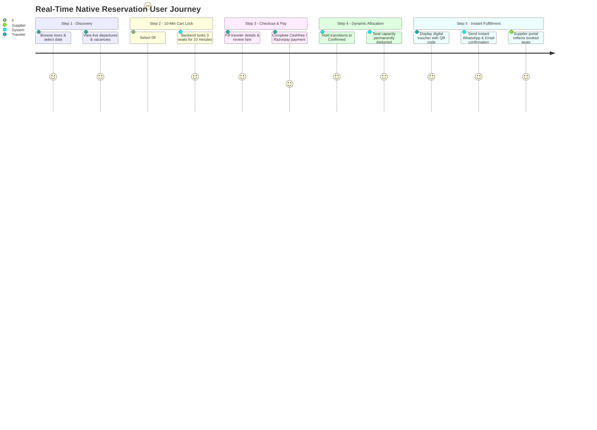

# Product Requirements Document (PRD): Idea Holiday Real-Time Reservation Platform

## 1. Product Overview & Strategic Mission
**Idea Holiday** is transforming into a real-time reservation platform like **Viator**, prioritizing **non-tech and manual/offline suppliers first** before connecting external ResTech channel managers (such as Bókun or FareHarbor).

### Core Objective (Phase 1)
Build and deploy a digital **Supplier Portal (Extranet) & Automated Reservation Engine** that transitions traditional manual/offline Indian tour suppliers into an automated, real-time online reservation ecosystem.

### Key Pillars
1. **Supplier Extranet**: A simple, intuitive dashboard for direct suppliers to create listings, set schedules, define real-time seat capacities, set booking cut-off rules, and manage blackout dates.
2. **Automated Inventory Engine**: Automatically deduct capacity upon successful booking, handle 10-minute temporary holds during checkout, and enforce cut-off times without manual supplier intervention.
3. **Real-Time User Booking**: Users see live seat availability on the frontend and receive instant booking confirmations with QR-coded digital vouchers.
4. **Scalable Architecture (OCTo-Ready)**: Design the database schema and business logic using **OCTo (Open Connectivity for Tourism)** standards so external ResTech APIs (Bókun, FareHarbor) can be plugged in seamlessly during Phase 2.

---

## 2. Target Personas & Core Problems

### Target Personas
1. **Offline / Non-Tech Supplier (Vikram - Tour Operator / Fleet Owner)**:
   - *Current State*: Manages bookings manually via phone calls, diary entries, and WhatsApp groups; faces frequent double-bookings and off-hours communication chaos.
   - *Needs*: An easy extranet to configure departure slots, seat quotas, cut-off rules, and view confirmed bookings in real time without technical training.
2. **Traveler (Aditi - Leisure & Business Tourist)**:
   - *Current State*: Frustrated by inquiry-only travel websites that require waiting hours for booking confirmation.
   - *Needs*: Instant visibility into live seat vacancies, guaranteed seat reservation while checking out, instant QR vouchers, and automated WhatsApp/email updates.
3. **Ground Operations Staff (Sunil - Dispatch & Ops Coordinator)**:
   - *Needs*: Centralized audit board of real-time seat holds, driver dispatches, and automated notification status.
4. **Platform Administrator (Meera - Super Admin)**:
   - *Needs*: Verified vendor KYB compliance, platform commission management, and financial reconciliation.

---

## 3. Complete Action Plan for Phase 1

### Step 1: Simplify the Supplier Onboarding Dashboard (Supplier Extranet)
- **Digital Inventory Builder**:
  - Suppliers choose an option and define operating weekdays (Monday through Sunday).
  - Configure daily departure time slots (e.g., `09:00 AM`, `02:00 PM`, `05:30 PM`).
  - Set maximum seat capacity per departure slot.
  - Define tiered pricing for Adult and Child units (in INR).
- **Automated Rules Engine**:
  - **Booking Cut-Off Rules**: Suppliers configure cut-off rules in minutes (`cutoff_minutes`, e.g., `120` = stop accepting bookings 2 hours before departure start time). The engine automatically closes departures past this threshold.
  - **Cancellation Windows**: Set free-cancellation deadlines in hours (e.g., `48` = full refund if cancelled > 48 hours before departure).
  - **Blackout Dates**: Select specific calendar dates to blackout operations without cancelling existing confirmed bookings.

### Step 2: Build the Real-Time Reservation Engine
- **Dynamic Seat Allocation**:
  - Compute live vacancies deterministically:
    $$\text{Vacancies} = \text{Configured Max Capacity} - \text{Confirmed Seats} - \text{Active Holds}$$
  - The instant a user completes payment, unconfirmed holds transition to confirmed seats atomically inside a database transaction.
- **10-Minute Cart Lock (`native_reservations`)**:
  - When a user enters the checkout flow, the system creates a 10-minute temporary seat hold bound to the user's session.
  - While on hold, these seats cannot be booked by any other user, preventing double-bookings.
  - If payment fails, times out, or the user abandons checkout, the hold automatically expires and inventory is returned to the public pool immediately.
- **Instant Confirmation & Delivery**:
  - Verified payments immediately mark the booking as confirmed and issue a digital voucher with an embedded QR code.
  - The system triggers automated real-time notifications:
    - **WhatsApp Cloud API**: Transactional template message containing booking reference, trip date/time, pickup point, and secure voucher URL.
    - **Email (SES / Brevo)**: Official HTML e-ticket and invoice with signed expiring links.
    - **SMS (Twilio)**: Automated assignment alerts to suppliers.

### Step 3: Database Foundation (OCTo API-Ready)
- Structure database tables, columns, and internal service interfaces to mirror the industry standard **OCTo (Open Connectivity for Tourism)** specification:
  - `productId`, `optionId`: Unique catalog and option identifiers.
  - `availabilityId` / `availability_slot`: Stable departure identifier (`YYYY-MM-DDTHH:MM:SS`).
  - `capacity`: Total departure seat count.
  - `vacancies`: Remaining bookable seats.
  - `unitItems`: Breakdown of passenger units (`ADULT`, `CHILD`).
  - `utcExpiresAt`: Temporary reservation lock tracking.
- Build the provider boundary (`reservationProviders.js`) with an abstracted interface (`availability`, `reserve`, `confirm`, `release`), with `NATIVE` as the primary connected provider.
- This guarantees that when Bókun or FareHarbor are connected in Phase 2, the marketplace frontend and database require **zero architectural rewrite**.

---

## 4. User Journeys

---

## 5. Functional Requirements Specification

### 5.1 Supplier Extranet & Inventory Builder
- **FR-01**: Suppliers can view and edit inventory under **Supplier dashboard → Listings → Seats and schedule**.
- **FR-02**: Interface allows configuring operating weekdays, departure times, seats per departure, adult/child prices, cut-off minutes, cancellation deadline hours, and blackout dates.
- **FR-03**: System rejects reducing capacity below the number of currently reserved/confirmed seats.
- **FR-04**: Adding blackout dates stops future bookings on that date without altering existing confirmed bookings.

### 5.2 Real-Time Availability & 10-Minute Cart Locks
- **FR-05**: Product details page polls live uncached departure availability every 15 seconds (`GET /api/availability/native/:productId?date=YYYY-MM-DD`).
- **FR-06**: Checkout entry creates an owner-bound 10-minute hold (`POST /api/availability/native/hold`).
- **FR-07**: Holds preserve the original expiration timer across page refreshes via stable idempotency keys.
- **FR-08**: Expired holds stop occupying seats immediately; background cleanup runs every 60 seconds.

### 5.3 Automated Reservation & Instant Confirmation
- **FR-09**: Verified payment transitions native hold from `ON_HOLD` to `CONFIRMED` inside an atomic transaction, deducting vacancies permanently.
- **FR-10**: System generates digital voucher with embedded QR code pointing to the signed traveler booking view.
- **FR-11**: System triggers outbox delivery (`native_reservation_outbox`) of WhatsApp, Email, and optional SMS notifications with replay-safe delivery keys.
- **FR-12**: Payment failures or cancellations immediately release held seats back to the inventory pool.

### 5.4 Scalable OCTo Data Models
- **FR-13**: Implement `native_inventory_rules`, `native_availability_slots`, `native_reservations`, `native_reservation_outbox`, and `reservation_external_references` matching OCTo specification entities.
- **FR-14**: Maintain provider abstraction layer in `reservationProviders.js` to ensure clean Phase 2 onboarding of Bókun and FareHarbor.

### 5.5 5 Product Types Marketplace Architecture
- **FR-15**: Support 5 operational product types (`TRANSFER`, `DAY_TOUR`, `MULTI_DAY_PACKAGE`, `ATTRACTION_TICKET`, `EXPERIENCE`).
- **FR-16**: Store and quote ticket tiers in `product_ticket_tiers` (`Adult`, `Child`, `Senior`, `Infant`), vehicle options in `product_vehicle_options`, shared tour hubs in `product_sic_hubs`, hotel tiers in `product_hotel_tiers`, and itineraries in `product_itinerary_items`.

### 5.6 Multi-Domain Architecture & ResTech Ingestion
- **FR-17**: Support multi-domain segregation across `ideaholiday.in` (consumer marketplace), `supply.ideaholiday.in` (supplier reservation extranet & dedicated login), and `admin.ideaholiday.in` (platform administration & dedicated login) with role enforcement on login.
- **FR-18**: Provide standard OCTo v1 REST API (`/api/octo/*`) and modular ResTech channel adapters (`BOKUN`, `FAREHARBOR`, `BOOKINGKIT`, `TOURCMS`, `ACTIVITAR`, `ANCHOR`, `OCTO_GENERIC`) allowing suppliers to import remote products and map IDs in `reservation_external_references`.

---

## 6. Non-Functional Requirements & Performance

- **NFR-01 (Availability Latency)**: Real-time availability checks must return in `< 200ms`.
- **NFR-02 (Concurrency Safety)**: PostgreSQL and SQLite serialize capacity mutations on the product/slot row inside transactions to eliminate race conditions under concurrent checkouts.
- **NFR-03 (Performance Budget)**: Frontend bundle must remain under 225 KiB initial entry to ensure rapid mobile loading across 4G/5G networks in India.
- **NFR-04 (Zero Downtime)**: Changes to inventory rules take effect immediately without requiring application or worker restarts.
