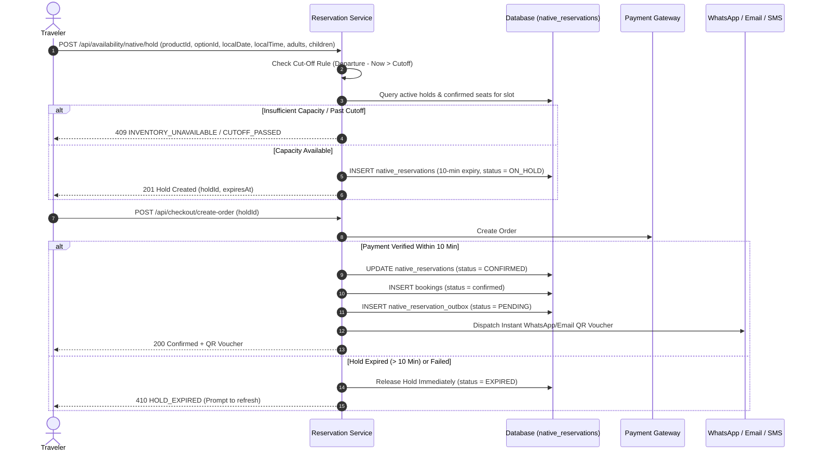
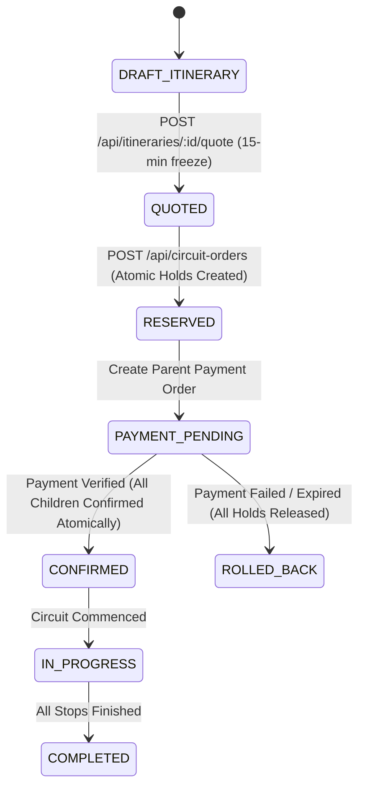

# System Design: Idea Holiday

## 1. System Components & Responsibilities

| Component | Key Module(s) | Primary Responsibilities |
| :--- | :--- | :--- |
| **Transfer Engine** | `backend/src/engine/transferEngine.js` | Spatial point-in-polygon checks, Haversine road-distance calculation, capacity filtering (pax + luggage), and dynamic cost estimation (base fare, tolls, interstate tax, GST). |
| **Location Validator** | `backend/src/services/locationValidationService.js` | Validates pickup/drop coordinates against product-scoped rules (`canonical_locations` and `product_location_rules`). Rejects invalid points with structured suggestions. |
| **Native Reservation Engine** | `backend/src/services/nativeInventoryService.js`, `reservationProviders.js`, `reservationOutboxService.js` | Manages 10-minute temporary seat holds (`native_reservations`), departures (`native_availability_slots`), rules (`native_inventory_rules`), instant confirmation, and durable outbox delivery. |
| **Circuit Orchestrator** | `backend/src/services/circuitOrderService.js`, `circuitManagementService.js` | Reprices multi-stop custom itineraries into immutable 15-minute `circuit_quotes`, manages atomic parent `circuit_orders`, child bookings, and coordinated reschedules/cancellations. |
| **5 Product Types Dispatcher** | `frontend/src/pages/ActivityDetail.jsx`, `LiveDeparturePicker.jsx`, `SupplierInventoryEditor.jsx` | Renders type-specific booking panels (`TRANSFER`, `DAY_TOUR`, `MULTI_DAY_PACKAGE`, `ATTRACTION_TICKET`, `EXPERIENCE`) and extranet inventory management. |
| **Pickup OTP Vault** | `backend/src/services/bookingService.js`, `driverDispatchService.js` | Creates cryptographically random 6-digit OTPs, computes verification SHA-256 hashes, encrypts cipher with AES-GCM, and isolates secrets from list APIs. |
| **Finance Engine** | `backend/src/services/financeService.js` | Freezes platform commission on booking creation, calculates retained commission on cancellation, aggregates settlements (`SCHEDULED → BATCHED → PROCESSED → RECONCILED`), and audits discrepancies. |
| **Assignment SLA Manager** | `backend/src/services/assignmentSlaService.js` | Enforces 24-hour supplier confirmation SLAs; automatically triggers reallocation or escalates expired requests to staff task queues. |
| **Notification Hub** | `backend/src/services/notificationService.js`, `whatsappService.js`, `smsService.js` | Dispatches templated WhatsApp messages, Amazon SES / Brevo emails with signed document URLs, and Twilio SMS. |

---

## 2. Core Operational Flows

### 2.1 Native Reservation, Supplier Extranet & Temporary Hold Flow
To digitize manual/offline tour operators and eliminate double-booking during checkout, the platform implements a 3-step real-time reservation architecture:

1. **Supplier Extranet & Inventory Builder**:
   - Direct suppliers define operating days, departure time slots (e.g., `09:00 AM`, `02:00 PM`), maximum seats per slot, and Adult/Child pricing tiers.
   - **Automated Cut-Off Rules**: Suppliers configure cut-off rules in minutes (`cutoff_minutes`, e.g., `120` = stop accepting bookings 2 hours before departure start time). The engine automatically closes departures past this threshold.
   - **Blackouts**: Calendar dates can be blacked out without cancelling existing confirmed bookings.
2. **Dynamic Seat Allocation & 10-Minute Cart Lock**:
   - When a user enters checkout, the engine creates a 10-minute temporary seat hold (`native_reservations`).
   - While on hold, those seats are locked from other buyers:
     $$\text{Vacancies} = \text{Configured Max Capacity} - \text{Confirmed Seats} - \text{Active Holds}$$
   - If payment fails, times out, or the user cancels, the hold is released immediately.
   - Upon verified payment, the hold transitions to `CONFIRMED` inside an atomic transaction without double-deduction.
3. **Instant Confirmation & QR Digital Vouchers**:
   - Verified bookings immediately generate a digital voucher with an embedded QR code pointing to the secure booking view.
   - The platform dispatches instant transactional notifications via WhatsApp (Meta Cloud API), Email (SES / Brevo), and optional SMS (Twilio).
4. **OCTo Standard Provider Boundary**:
   - `backend/src/services/reservationProviders.js` exposes standard OCTo methods (`availability`, `reserve`, `confirm`, `release`).
   - The `NATIVE` provider powers Phase 1 direct extranet suppliers. In Phase 2, external connectors for Bókun and FareHarbor plug into this same interface without database changes.



---

## 2.2 Grouped Circuit Ordering & Atomic Multi-Supplier Rollback
Travelers can assemble multi-day custom journeys across multiple independent suppliers. The system guarantees atomic confirmation:



- **All-or-Nothing Guarantee**: If any supplier's capacity becomes unavailable before payment, the entire circuit reservation is declined. No traveler is left with a half-booked itinerary.
- **Grouped Payment**: One transaction reference covers all child bookings; each child booking maintains its own independent supplier payout record.

---

## 2.3 Pickup OTP Cryptographic Security Lifecycle

To prevent driver imposters and ensure traveler safety, the pickup handshake follows strict cryptographic separation:

```mermaid
flowchart TD
    Create["Payment Confirmed"] --> GenOTP["Generate 6-digit random code<br/>(e.g. '849201')"]
    GenOTP --> Hash["Compute SHA-256 Hash<br/>(Stored in 'pickup_otp_hash')"]
    GenOTP --> Encrypt["Encrypt via AES-256-GCM<br/>(Stored in 'pickup_otp_encrypted')"]
    Hash --> DB[(Database)]
    Encrypt --> DB
    
    subgraph AccessControls ["API Boundary"]
        DB -.-> TravelerAPI["Traveler API / My Trips<br/>(Decrypted & Displayed)"]
        DB -.x OpsAPI["Staff / Supplier / Driver APIs<br/>(Secret strictly redacted)"]
    end
    
    subgraph PickupVerification ["Pickup Handshake"]
        TravelerAPI --> TravelerPhone["Traveler shares code verbally<br/>AFTER verifying vehicle plate"]
        TravelerPhone --> DriverInput["Driver inputs code into portal"]
        DriverInput --> VerifyAPI["POST /api/bookings/:id/verify-pickup-otp"]
        VerifyAPI --> CheckAttempts{"Attempts < 5?"}
        CheckAttempts -- No --> Lock["Lock Verification<br/>(Status = OTP_LOCKED)"]
        CheckAttempts -- Yes --> CompareHash{"SHA-256(Input) == Hash?"}
        CompareHash -- Match --> Success["Trip Status = IN_PROGRESS<br/>Attempts Reset"]
        CompareHash -- Mismatch --> Increment["Increment Attempt Count<br/>Return Remaining Attempts"]
    end
```

---

## 2.4 Background Jobs & SLA Monitors
1. **Supplier Response SLA (24 Hours)**:
   - Evaluated via `processExpiredSupplierAssignments()` in `assignmentSlaService.js`.
   - When a supplier fails to confirm an assigned booking within their deadline, the booking is automatically transitioned to `REALLOCATION_PENDING` and a high-priority `staff_tasks` row is created for Operations.
2. **Circuit Reschedule Reconfirmation SLA**:
   - Evaluated via `processExpiredCircuitReconfirmations()` in `circuitOrchestrationService.js`.
   - When a traveler requests a circuit reschedule, every affected supplier has 24 hours to accept new dates. Rejections or timeouts prevent single-stop fragmentation and escalate the parent order to Operations review.
3. **Automated Reminders Scanner**:
   - Runs periodic scans (`triggerAutomatedReminders()`):
     - **24-Hour Pre-Trip Reminder**: Sends WhatsApp and email alerts containing driver details and vehicle registration to travelers departing in 24–36 hours.
     - **Post-Trip Review Invitation**: Sends feedback requests with direct review links to travelers whose bookings were marked `completed` within the last 24 hours.
   - Enforces strict idempotency keys (`bookingId:PRE_TRIP_REMINDER:24H` and `bookingId:POST_TRIP_REVIEW_INVITE`), ensuring no traveler is messaged twice.
4. **Native Reservation Outbox Worker**:
   - Runs every 5 seconds via `processReservationOutbox()` to guarantee at-least-once delivery of notifications for instant bookings.

---

## 2.5 Security Boundaries & Sanitization
- **Logging Redaction**: Winston logger recursively strips sensitive keys (`password`, `token`, `otp`, `pickup_otp`, `bank_account`, `pan_number`, `gstin`, `credit_card`).
- **Data Boundary Protection**: Deeply nested JSON payloads (>10 levels) or payloads containing prototype keys (`__proto__`) are terminated immediately at the Express middleware layer with HTTP 400.
